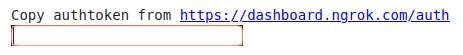
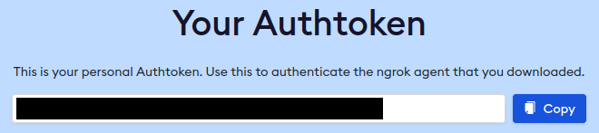
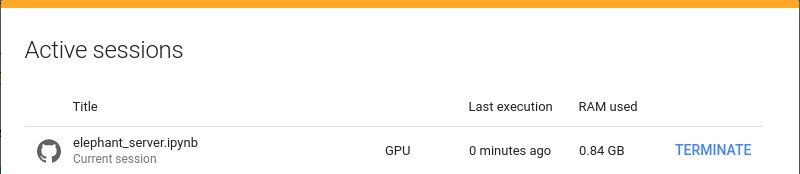
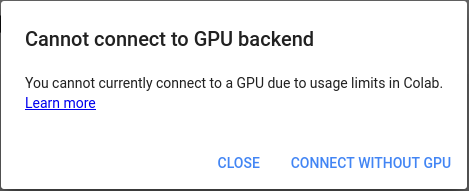
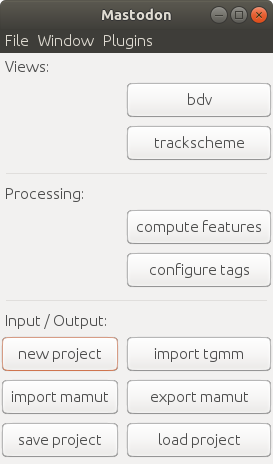

# ELEPHANT: Tracking cell lineages in 3D by incremental deep learning

<br>

<table class="topbox">
  <tbody>
    <tr>
      <th colspan=2></th>
    </tr>
    <tr>
      <td>Developer</td>
      <td><a href="http://www.ens-lyon.fr/lecole/nous-connaitre/annuaire/ko-sugawara">Ko Sugawara</a></td>
    </tr>
    <tr>
      <td>Forum</td>
      <td><a href="https://forum.image.sc/tag/elephant">Image.sc forum</a><br>Please post feedback and questions to the forum.<br>It is important to add the tag <code>elephant</code> to your posts so that we can reach you quickly.</td>
    </tr>
    <tr>
      <td>Source code</td>
      <td><a href="https://github.com/elephant-track">GitHub</a></td>
    </tr>
    <tr>
      <td>Publication</td>
      <td>Sugawara, K., Cevrim, C. & Averof, M. <a href="https://biorxiv.org/cgi/content/short/2021.02.26.432552v1"><i>Tracking cell lineages in 3D by incremental deep learning.</i></a> bioRxiv 2021. doi:10.1101/2021.02.26.432552</td>
    </tr>
  </tbody>
</table>

</img>

## Overview

ELEPHANT is a platform for 3D cell tracking, based on incremental and interactive deep learning.\
It works on client-server architecture. The server is built as a web application that serves deep learning-based algorithms.
The client application is implemented by extending [Mastodon](https://github.com/mastodon-sc/mastodon), providing a user interface for annotation, proofreading and visualization.
Please find <a href="#/?id=system-requirements" onclick="alwaysScroll(event)">below</a> the system requirements for each module.

<div class="toggle hidden">
  </img>
  <br>
  <a href="javascript:void(0)" onClick="setImageVisible(event, 'elephant-architecture')">image</a>
</div>

## System Requirements

### ELEPHANT Server Requirements (Docker)

|                  | Requirements                                                                                                                                                                                                                                                                                |
| ---------------- | ------------------------------------------------------------------------------------------------------------------------------------------------------------------------------------------------------------------------------------------------------------------------------------------- |
| Operating System | Linux-based OS compatible with [NVIDIA Container Toolkit](https://docs.nvidia.com/datacenter/cloud-native/container-toolkit/install-guide.html)                                                                                                                                             |
| Docker           | [Docker](https://www.docker.com/) with [NVIDIA Container Toolkit](https://docs.nvidia.com/datacenter/cloud-native/container-toolkit/install-guide.html) (see [supported versions](https://docs.nvidia.com/datacenter/cloud-native/container-toolkit/install-guide.html#container-runtimes)) |
| GPU              | NVIDIA CUDA GPU with sufficient VRAM for your data (recommended: 11 GB or higher)                                                                                                                                                                                                           |
| Storage          | Sufficient size for your data (recommended: 1 TB or higher)                                                                                                                                                                                                                                 |
### ELEPHANT Server Requirements (Singularity)

|                  | Requirements                                                                                                                                                    |
| ---------------- | --------------------------------------------------------------------------------------------------------------------------------------------------------------- |
| Operating System | Linux-based OS                                                                                                                                                  |
| Singularity      | [Singularity](https://sylabs.io/guides/3.7/user-guide/index.html) (see [requirements for NVIDIA GPUs & CUDA](https://sylabs.io/guides/3.7/user-guide/gpu.html)) |
| GPU              | NVIDIA CUDA GPU with sufficient VRAM for your data (recommended: 11 GB or higher)                                                                               |
| Storage          | Sufficient size for your data (recommended: 1 TB or higher)                                                                                                     |

| Info <br> :information_source: | The total amount of data can be 10-30 times larger than the original data size when the prediction outputs (optional) are generated. |
| :----------------------------: | :----------------------------------------------------------------------------------------------------------------------------------- |

### ELEPHANT Client Requirements

|                  | Requirements                                                                                                              |
| ---------------- | ------------------------------------------------------------------------------------------------------------------------- |
| Operating System | Linux, Mac or Windows OS                                                                                                  |
| Java             | Java Runtime Environment 8 or higher                                                                                      |
| Storage          | Sufficient size for your data (Please consider using [BigDataServer](https://imagej.net/BigDataServer) for the huge data) |

## ELEPHANT Data Overview

The ELEPHANT client uses the same type of image files as Mastodon. The image data are imported as a pair of HDF5 (`.h5`) and XML (`.xml`)
files from BigDataViewer (BDV).

The ELEPHANT server stores image, annotation and prediction data in Zarr (`.zarr`) format.

| Data type                  | Client                         | Server         |
| -------------------------- | ------------------------------ | -------------- |
| Image                      | HDF5 (`.h5`)                   | Zarr (`.zarr`) |
| Image metadata             | XML (`.xml`)                   | Not available  |
| Annotation                 | Mastodon project (`.mastodon`) | Zarr (`.zarr`) |
| Prediction                 | Mastodon project (`.mastodon`) | Zarr (`.zarr`) |
| Project metadata           | Mastodon project (`.mastodon`) | Not available  |
| Viewer settings (Optional) | XML (`.xml`)                   | Not available  |


## Getting Started

ELEPHANT's server and client are organized separately.
Please follow the instructions below to set them up.

### Setting up the ELEPHANT Server

There are three options to set up the ELEPHANT server.

- <a href="#/?id=setting-up-with-docker" onclick="alwaysScroll(event)">Setting up with Docker</a>
  
  This option is recommended if you have a powerful computer that satisfies <a href="#/?id=elephant-server-requirements-docker" onclick="alwaysScroll(event)">the server requirements (Docker)</a> with root privileges.

- <a href="#/?id=setting-up-with-singularity" onclick="alwaysScroll(event)">Setting up with Singularity</a>
  
  This option is recommended if you can access a powerful computer that satisfies <a href="#/?id=elephant-server-requirements-singularity" onclick="alwaysScroll(event)">the server requirements (Singularity)</a> as a non-root user (e.g. HPC cluster).

- <a href="#/?id=setting-up-with-google-colab" onclick="alwaysScroll(event)">Setting up with Google Colab</a>
  
  Alternatively, you can set up the ELEPHANT server with [Google Colab](https://research.google.com/colaboratory/faq.html), a freely available product from Google Research. In this option, you don't need to have a high-end GPU or a Linux machine to start using ELEPHANT's deep learning capabilities.

#### Setting up with Docker

##### Prerequisite

Please check that your computer meets <a href="#/?id=elephant-server-requirements" onclick="alwaysScroll(event)">the server requirements</a>.

Install [Docker](https://www.docker.com/) with [NVIDIA Container Toolkit](https://github.com/NVIDIA/nvidia-docker).

By defaut, ELEPHANT assumes you can [run Docker as a non-root user](https://docs.docker.com/engine/install/linux-postinstall/).\
If you need to run `Docker` with `sudo`, please set the environment variable `ELEPHANT_DOCKER` as below.

```bash
export ELEPHANT_DOCKER="sudo docker"
```

Alternatively, you can set it at runtime.

```bash
make ELEPHANT_DOCKER="sudo docker" bash
```

##### 1.Download/Clone a repository

Download and extract a [.zip file](https://github.com/elephant-track/elephant-server/releases/download/v0.1.0/elephant-server-0.1.0.zip).

Alternatively, you can clone a repository from [GitHub](https://github.com/elephant-track/elephant-server).

```bash
git clone https://github.com/elephant-track/elephant-server.git
```

##### 2. Build a Docker image

First, change the directory to the project root.

```bash
cd elephant-server-0.1.0
```

The following command will build a Docker image that integrates all the required modules.

```bash
make build
```

##### 3. Generate a dataset for the ELEPHANT server

Please [prepare](https://imagej.net/BigDataViewer.html#Exporting_from_ImageJ_Stacks) your image data, producing a pair of [BigDataViewer](https://imagej.net/BigDataViewer) `.h5` and `.xml` files, or [download the demo data](https://doi.org/10.5281/zenodo.4549193) and extract it as below.

The ELEPHANT server deals with images using [Zarr](https://zarr.readthedocs.io/en/stable/). The following command generates required `zarr` files from the [BigDataViewer](https://imagej.net/BigDataViewer) `.h5` file.


```bash
workspace
├── datasets
│   └── elephant-demo
│       ├── elephant-demo.h5
│       └── elephant-demo.xml
```

Run the script inside a Docker container.

```bash
make bash # run bash inside a docker container
```

```bash
python /opt/elephant/script/dataset_generator.py --uint16 /workspace/datasets/elephant-demo/elephant-demo.h5 /workspace/datasets/elephant-demo
# usage: dataset_generator.py [-h] [--uint16] [--divisor DIVISOR] input output

# positional arguments:
#   input              input .h5 file
#   output             output directory

# optional arguments:
#   -h, --help         show this help message and exit
#   --uint16           with this flag, the original image will be stored with
#                      uint16
#                      default: False (uint8)
#   --divisor DIVISOR  divide the original pixel values by this value (with
#                      uint8, the values should be scale-downed to 0-255)

exit # exit from a docker container
```

You will find the following results.

```
workspace
├── datasets
│   └── elephant-demo
│       ├── elephant-demo.h5
│       ├── elephant-demo.xml
│       ├── flow_hashes.zarr
│       ├── flow_labels.zarr
│       ├── flow_outputs.zarr
│       ├── imgs.zarr
│       ├── seg_labels_vis.zarr
│       ├── seg_labels.zarr
│       └── seg_outputs.zarr
```

| Info <br> :information_source: | By default, the docker container is launched with [volumes](https://docs.docker.com/storage/volumes/), mapping the local `workspace/` directory to the `/workspace/` directory in the container. <br> The local workspace directory can be set by the `ELEPHANT_WORKSPACE` environment variable (Default: `${PWD}/workspace`). |
| :----------------------------: | :----------------------------------------------------------------------------------------------------------------------------------------------------------------------------------------------------------------------------------------------------------------------------------------------------------------------------- |

```bash
# This is optional
export ELEPHANT_WORKSPACE="YOUR_WORKSPACE_DIR"
make bash
```

```bash
# This is optional
make ELEPHANT_WORKSPACE="YOUR_WORKSPACE_DIR" bash
```

| Info <br> :information_source: | Multi-view data is not supported by ELEPHANT. You need to create a fused data (e.g. with [BigStitcher Fuse](https://imagej.net/BigStitcher_Fuse)) before converting to `.zarr` . |
| :----------------------------: | :------------------------------------------------------------------------------------------------------------------------------------------------------------------------------- |

##### 4. Launch the ELEPHANT server via Docker

The ELEPHANT server is accompanied by several services, including [Flask](https://flask.palletsprojects.com/en/1.1.x/),
[uWSGI](https://uwsgi-docs.readthedocs.io/en/latest/), [NGINX](https://www.nginx.com/), [redis](https://redis.io/)
and [RabbitMQ](https://www.rabbitmq.com/).
These services are organized by [Supervisord](http://supervisord.org/) inside the Docker container,
exposing the port `8080` for [NGINX](https://www.nginx.com/) and `5672` for [RabbitMQ](https://www.rabbitmq.com/) available on `localhost`. 

```bash
make launch # launch the services
```

Now, the ELEPHANT server is ready.

#### Setting up with Singularity

##### Prerequisite

`Singularity >= 3.6.0` is required. Please check the version of Singularity on your system.

```bash
singularity --version
```

Please [download the release `v0.1.0-singularity`](https://github.com/elephant-track/elephant-server/archive/refs/tags/v0.1.0-singularity.zip), or checkout the tag `v0.1.0-singularity` on Git to follow the instructions below.

##### 1. Build a container

Run the following command at the project root directory where you can find a `elephant.def` file.

```bash
singularity build --fakeroot elephant.sif elephant.def
```

##### 2. Prepare files to bind

The following command copies `/var/lib/`, `/var/log/` and `/var/run/` in the container to `$HOME/.elephant_binds` on the host.

```bash
singularity run --fakeroot elephant.sif
```

##### 3. Start an instance for the ELEPHANT server

It is recommended to launch the ELEPHANT server inside a singularity `instance` rather than using `shell` or `exec` directly, which can make some processes alive after exiting the `supervisor` process. All processes inside a `instance` can be terminated by stopping the `instance` ([see details](https://sylabs.io/guides/3.7/user-guide/running_services.html#container-instances-in-singularity)).

The command below starts an `instance` named `elephant` using the image written in `elephant.sif`.\
The `--nv` option is required to set up the container that can use NVIDIA GPU and CUDA ([see details](https://sylabs.io/guides/3.7/user-guide/gpu.html)).\
The `--bind` option specifies the directories to bind from the host to the container ([see details](https://sylabs.io/guides/3.7/user-guide/bind_paths_and_mounts.html)). The files copied in the previous step are bound to the original container location as `writable` files. Please set `$ELEPHANT_WORKSPACE` to the `workspace` directory on your system.

```bash
singularity instance start --nv --bind $HOME/.elephant_binds/var/lib:/var/lib,$HOME/.elephant_binds/var/log:/var/log,$HOME/.elephant_binds/var/run:/var/run,$ELEPHANT_WORKSPACE:/workspace elephant.sif elephant
```

##### 4. Generate a dataset for the ELEPHANT server

The following command will generate a dataset for the ELEPHANT server.
Please see details in <a href="#/?id=_3-generate-a-dataset-for-the-elephant-server" onclick="alwaysScroll(event)">the Docker part</a>.

```bash
singularity exec instance://elephant python /opt/elephant/script/dataset_generator.py --uint16 /workspace/datasets/elephant-demo/elephant-demo.h5 /workspace/datasets/elephant-demo
```

##### 5. Launch the ELEPHANT server

The following command execute a script that launches the ELEPHANT server.
Please specify the `SINGULARITYENV_CUDA_VISIBLE_DEVICES` if you want to use a specific GPU device on your system (default: `0`).

```bash
SINGULARITYENV_CUDA_VISIBLE_DEVICES=0 singularity exec instance://elephant /start.sh
```

At this point, you will be able to work with the ELEPHANT server.
Please follow <a href="#/?id=remote-connection-to-the-elephant-server" onclick="alwaysScroll(event)">the instructions for seting up the remote connection</a>.

##### 6. Stop an instance for the ELEPHANT server

After exiting the `exec` by `Ctrl+C`, please do not forget to stop the `instance`.

```bash
singularity instance stop elephant
```

#### Setting up with Google Colab

##### 1. Prepare a Google account

If you already have one, you can just use it. Otherwise, create a Google account [here](https://accounts.google.com/signup).

##### 2. Create a ngrok account

Create a ngrok account from the following link.

[ngrok - secure introspectable tunnels to localhost](https://dashboard.ngrok.com/signup)

##### 3. Open and run a Colab notebook

Open a Colab notebook from this button. [](https://colab.research.google.com/github/elephant-track/elephant-server/blob/main/elephant_server.ipynb)

On Goolge Colab, run the command [Runtime > Run all] and select `RUN ANYWAY` in the following box.

</img>

##### 4. Start a ngrok tunnel

After around 10 minutes, you will find the following box on the bottom of the page.

</img>

Click the link to open your ngrok account page and copy your authtoken, then paste it to the box above.

</img>

After inputting your authtoken, you will have many lines of outputs. Scroll up and find the following two lines.

```Colab
SSH command: ssh -p[your_random_5digits] root@[your_random_value].tcp.ngrok.io
Root password: [your_random_password]
```

##### 5. Establish connections from your computer to the server on Colab

On your computer, launch a powershell (Windows) or terminal (Mac&Linux) and run the following command. Please leave the powershell/terminal window open.

| Info <br> :information_source: | Please do not forget to replace `your_random_5digits` and `your_random value`. When you are asked a password, use the `your_random_password` found in the previous step. |
| :----------------------------: | :----------------------------------------------------------------------------------------------------------------------------------------------------------------------- |

Windows:

```Powershell
ssh.exe -N -L 8080:localhost:80 -o PubkeyAuthentication=no -o TCPKeepAlive=yes -o ServerAliveInterval=30 -p[your_random_5digits] root@[your_random value].tcp.ngrok.io
```

Mac&Linux:

```bash
ssh -N -L 8080:localhost:80 -o PubkeyAuthentication=no -o TCPKeepAlive=yes -o ServerAliveInterval=30 -p[your_random_5digits] root@[your_random value].tcp.ngrok.io
```

Continue with `yes` if you are asked the following question.

```
Are you sure you want to continue connecting (yes/no)? 
```

Launch another powershell (Windows) or terminal (Mac&Linux) and run the following command. Please leave the powershell/terminal window open.

Windows:

```Powershell
ssh.exe -N -L 5672:localhost:5672 -o PubkeyAuthentication=no -o TCPKeepAlive=yes -o ServerAliveInterval=30 -p[your_random_5digits] root@[your_random value].tcp.ngrok.io
```

Mac&Linux:

```
ssh -N -L 5672:localhost:5672 -o PubkeyAuthentication=no -o TCPKeepAlive=yes -o ServerAliveInterval=30 -p[your_random_5digits] root@[your_random value].tcp.ngrok.io
```

##### 6. Terminate

When you finish using the ELEPHANT, stop and terminate your Colab runtime so that you can release your resources.

- Stop the running execution by [Runtime > Interrupt execution]
- Terminate the runtime by [Runtime > Manage sessions]

</img>

| Info <br> :information_source: | If you see the following message, it is likely that you exceeded the usage limits. Unfortunately, you cannot use Colab with GPU at the moment. See details <a href="https://research.google.com/colaboratory/faq.html#usage-limits">here</a> |
| :----------------------------: | :------------------------------------------------------------------------------------------------------------------------------------------------------------------------------------------------------------------------------------------- |

</img>


### Installing the ELEPHANT Client

The ELEPHANT client works as a plugin for [Mastodon](https://github.com/mastodon-sc/mastodon).
However, because ELEPHANT was built on a specific version of Mastodon, with minor customization,
we ask users to download and use a self-contained executable instead of the official release available on [Fiji](https://imagej.net/Fiji).

| Info <br> :information_source: | Mastodon user manual is available [here](https://github.com/mastodon-sc/mastodon-manual/blob/pdf/MastodonManual.pdf). |
| :----------------------------: | :-------------------------------------------------------------------------------------------------------------------- |

#### 1. Download an executable jar

Please [download a zip file](https://github.com/elephant-track/elephant-client/releases/download/v0.1.0/elephant-0.1.0-client.zip) that contains the latest version of executable jar with dependencies in the `lib/` directory.

#### 2. Launch an application

Double click the executable jar with the name `elephant-0.1.0-client.jar`.\
Alternatively, launch an application from CLI, which is better for debugging in case of problems.

```bash
java -jar elephant-0.1.0-client.jar
```

| Info <br> :information_source: | ELEPHANT is built with `openjdk version "1.8.0_275"`. It should work with Java Runtime Environment (JRE) version 8 or higher. <br> You can download a prebuilt OpdnJDK binary [here](https://adoptopenjdk.net/). |
| :----------------------------: | :--------------------------------------------------------------------------------------------------------------------------------------------------------------------------------------------------------------- |

A main window will be shown as below.

</img>

### Create a Mastodon project

#### 1. Locate the dataset to work with

First, please locate <a href="#/?id=_3-generate-a-dataset-for-the-elephant-server" onclick="alwaysScroll(event)">the BDV dataset</a> you prepared for the server.

#### 2. Create a new project

Click the `new project` button in the main window.

Please specify the `.xml` file for the dataset.

</img>

Now, you will see that all buttons are availble on the main window.

</img>

#### 3. Save & load a Mastodon project

You can save a project by [File > Save Project], `save project` button in the main dialog or shortcut `S`, generating a `.mastodon` file.

A `.mastodon` project file can be loaded by [File > Load Project] or `load project` button in the main dialog

### Working with a BigDataViewer (BDV) window

#### 1. BigDataViewer window

Click the `bdv` button in the main window.

The following window will pop up.

</img>

#### 2. Shortcuts

ELEPHANT inherits the user-friendly [shortcuts](https://github.com/mastodon-sc/mastodon#actions-and-keyboard-shortcuts) from Mastodon.
Please install the shortcut setting by copying <a href="_media/elephant_keymaps.yaml" download>this file</a> to the `~/.mastodon/keymaps/` directory and editing the `~/.mastodon/keymaps/keymaps.yaml` file as below.

| Info <br> :information_source: | If you cannot find the `~/.mastodon/keymaps/` directory, please run [File > Preferences...] first to create it with the `~/.mastodon/keymaps/keymaps.yaml`. |
| :----------------------------: | :---------------------------------------------------------------------------------------------------------------------------------------------------------- |

```yaml
!keymapslist
defaultKeymapName: Elephant
keymapNameToFileName:
  Elephant: elephant_keymaps.yaml
```

The following table summaraizes the frequently-used actions used in the BDV window.

| Info <br> :information_source: | If you are already familiar with Mastodon, please note that some shortcuts are modified from [the default shortcuts](https://github.com/mastodon-sc/mastodon#actions-and-keyboard-shortcuts). |
| :----------------------------: | :-------------------------------------------------------------------------------------------------------------------------------------------------------------------------------------------- |

| Action                                                      | Shortcut                                                                                                                                                                           |
| ----------------------------------------------------------- | ---------------------------------------------------------------------------------------------------------------------------------------------------------------------------------- |
| Move in X & Y                                               | `Right-click`+`mouse-drag`                                                                                                                                                         |
| Move in Z                                                   | `Mouse-wheel` (Press and hold `Shift` to move faster, `Ctrl` to move slower)                                                                                                       |
| Align view with <br> XY / YZ / XZ planes                    | `Shift`+`Z` (XY plane) <br> `Shift`+`X` (YZ plane) <br> `Shift`+`Y` (XZ plane)                                                                                                     |
| Zoom / Unzoom                                               | `Ctrl`+`Shift`+`mouse-wheel`                                                                                                                                                       |
| Next time-point                                             | `3`                                                                                                                                                                                |
| Previous time-point                                         | `2`                                                                                                                                                                                |
| Brightness and color dialog                                 | `P`                                                                                                                                                                                |
| Save display settings                                       | `F11`                                                                                                                                                                              |
| Open a new BDV window                                       | `V`                                                                                                                                                                                |
| Add a new spot                                              | `A`                                                                                                                                                                                |
| Move the highlighted spot                                   | `Space`+`mouse-drag`                                                                                                                                                               |
| Remove the highlighted spot                                 | `D`                                                                                                                                                                                |
| Navigate to the highlighted spot                            | `W`                                                                                                                                                                                |
| Increase / Decrease the radius <br> of the highlighted spot | `E`/`Q` (Medium step)  <br> `Shift`+`E`/`Shift`+`Q` (Coarse step) <br> `Ctrl`+`E`/`Ctrl`+`Q` (Fine step) <br> `Alt`+`E`/`Alt`+`Q` (Selected axis with medium step) *ELEPHANT only* |
| Select axis                                                 | `Alt`+`X` (X axis) <br> `Alt`+`Y` (Y axis) &nbsp;&nbsp;&nbsp; *ELEPHANT only* <br> `Alt`+`Z` (Z axis)                                                                              |
| Rotate the highlighted spot                                 | `Alt`+`←` (Counterclockwise) / `Alt`+`→` (Clockwise)&nbsp;&nbsp;&nbsp; *ELEPHANT only*                                                                                             |

#### 3. Annotating spots

Ellipsoids can be added and manipulated to annotate spots (e.g. nuclei) using shortcuts, as shown below.

Please put all BDV windows in the same group by clicking the key icon </img> on top left in the window to synchronize them.

<video controls>
  <source src="_media/ellipsoid-control.mp4" type="video/mp4">
  Your browser does not support the video tag.
</video> 

#### 4. Tagging spots

The tagging function of Mastodon can provide specific information on each spot. ELEPHANT will use the **Tag** information for processing.

In the detection workflow, the **Detection** tag set is used (See <a href="#/?id=tag-sets-available-on-elephant" onclick="alwaysScroll(event)">below</a> for all provided tag sets available on ELEPHANT).

Spots can be colored based on their tags by selecting the Detection coloring mode in [View > Coloring > Detection].

</img>

ELEPHANT provides the following shortcut keys for annotating spots with the **Detection** tag.

| Tag       | Shortcut |
| --------- | -------- |
| tp        | 4        |
| fp        | 5        |
| tn        | 6        |
| fn        | 7        |
| tb        | 8        |
| fb        | 9        |
| unlabeled | 0        |

| Info <br> :information_source: | Border annotations (`tb` and `fb`) are not so frequently used but they are helpful to separate attaching spots. |
| :----------------------------: | :-------------------------------------------------------------------------------------------------------------- |

Predicted spots and manually added spots are tagged by default as `unlabeled` and `fn`, respectively.

<video controls>
  <source src="_media/annotation-with-shortcuts.mp4" type="video/mp4">
  Your browser does not support the video tag.
</video> 

#### 5. Link Annotations

Link annotations can be added in the following four ways on the BDV window; pressing down one of the following keys (keydown) will move you automatically to the next or the previous timepoint (depending on the command, see below):

1. Keydown `A` on the highlighted spot, then keyup at the position where you want to add a linked spot in the next timepoint.
2. Keydown `L` on the highlighted spot, then keyup on the target annotated spot in the next timepoint.
3. Keydown `C` on the highlighted spot, then key up at the position you want to add a linked spot in the previous timepoint.
4. Keydown `Shift`+`L` on the highlighted spot, then keyup on the target annotated spot in the previous timepoint.

Spots and links that are added manually in this fashion are automatically tagged as `Approved` in the `Tracking` tag set.

To visualize the `Tracking` tag, set the coloring mode to `Tracking` by [View > Coloring > Tracking].

<video controls>
  <source src="_media/linking-annotation.mp4" type="video/mp4">
  Your browser does not support the video tag.
</video> 

### Detection workflow

#### 1. Settings

Open a Preferences dialog [Plugins > ELEPHANT > Preferences...].

</img>

Change the dataset name to `elephant-demo` (or the name you specified for your dataset).

When you change some value in the settings, a new setting profile is created automatically.

| Info <br> :information_source: | The profile name can be renamed. |
| :----------------------------: | :------------------------------- |

</img>

Press the `Apply` button on bottom right and close the settings dialog (`OK` or `x` button on top right).

Please check <a href="#/?id=settings-parameters" onclick="alwaysScroll(event)">the settings parameters table</a> for detailed descriptions about the parameters.

#### 2. Initialize a model

First, you need to initialize a model by [Plugins > ELEPHANT > Detection > Reset Seg Model].

This command creates a new model parameter file with the name you specified in the settings (`seg.pth` by default) in the `workspace/models/` directory, which lies in the directory you launched on the server. At the initialization step, the model parameters are pre-trained with the fluorescence image itself, without any annotations. This will take ~20 seconds.

#### 3. Prediction

After initialization of a model you can try a prediction. [Plugins > ELEPHANT > Detection > Predict Spots]

We cannot expect too much at this point, but the software will generate some predictions.

| Info <br> :information_source: | `Alt`+`F` is a shortcut for prediction |
| :----------------------------: | :------------------------------------- |

</img>

#### 4. Training on batch mode

Based on the prediction results, you can add annotations as described earlier.

</img>

Train the model by [Plugins > ELEPHANT > Detection > Train Selected Timpepoints].

Predictions with the updated model should yield better results.

</img>

In general, a batch mode is used for training with relatively large amounts of data. For more interactive training, please use the live mode explained below. 

#### 5. Training on live mode

In live mode, you can iterate the cycles of annotation, training, prediction and proofreading more frequently.

Start live mode by [Plugins > ELEPHANT > Detection > Live Training].

During live mode, you can find the text "live mode" on top of the BDV view.

</img>

Every time you update the labels (Shortcut: `U`), a new training epoch will start, with the latest labels in the current timepoint.

<video controls>
  <source src="_media/live-training.mp4" type="video/mp4">
  Your browser does not support the video tag.
</video> 

#### 6. Importing and extending a pretrained model

Importing a pretrained model is simple. Just specify the model parameter file located at the `workspace/models` in the settings.

You can download [a pretrained parameter file](https://github.com/elephant-track/elephant-server/releases/download/v0.1.0/elephant-demo_seg.pth) for the demo dataset.

### Linking workflow

#### 1. Prepare a dataset for linking

Here, we will load a project from a `.masotodon` project that contains spots generated by the pretrained detection model.\
Alternatively, you can prepare it by yourself.

#### 2. Settings for linking

We start with a linking using the nearest neighbor algorithm without flow support.

Please confirm that the `use optical flow for linking` option is `off`.

For other settings, please check <a href="#/?id=settings-parameters" onclick="alwaysScroll(event)">the detailed descriptions</a>.

#### 3. Nearest neighbor algorithm without flow support

In the demo dataset, please go to the last timepoint (t = 9).

Run the nearest neighbor linking action by `Alt`+`L` or [Plugins > ELEPHANT > Linking > Nearest Neighbor Linking].

<video controls width>
  <source src="_media/nn-linking.mp4" type="video/mp4">
  Your browser does not support the video tag.
</video> 

#### 4. Nearest neighbor algorithm with flow support

Please turn on the `use optical flow for linking` option.

Download a pretrained model parameter file for flow [here]() and place it at `workspace/models/`.

Run the nearest neighbor linking action by `Alt`+`L` or [Plugins > ELEPHANT > Linking > Nearest Neighbor Linking].

<video controls>
  <source src="_media/nn-flow-linking.mp4" type="video/mp4">
  Your browser does not support the video tag.
</video>

#### 5. Proofreading

Using both the BDV window and the trackscheme, you can remove/add/modify spots and links to build a complete lineage tree.

Once you finish proofreading of a track (or a tracklet), you can tag it as `Approved` in the `Tracking` tag set.

Select all spots and links in the track by `Shift`+`Space`, and [Edit > Tags > Tracking > Approved] or the shortcuts `Y` > `2` > `1` in the Trackshcem view.

Spots and links tagged with `Approved` are not removed in the next cycle of prediction. The `approved` links are used for training of a flow model.

<video controls>
  <source src="_media/linking-proofreading.mp4" type="video/mp4">
  Your browser does not support the video tag.
</video>

#### 6. Training a flow model

Once you collect certain amount of link annotations, a flow model can be trained with them by [Plugins > ELEPHANT > Linking > Train Optical Flow].

Currently, there is only a batch mode for training of a flow model, which works with the annotations in the time range specified in the settings.

If you start training from scratch, it will take relatively long time to get the flow model to converge. Alternatively, you can incrementally train a model, starting with the pretrained model parameters.

## Action list

<table>
  <thead>
    <tr>
      <th>Category</th>
      <th>Action</th>
      <th>On Menu</th>
      <th>Shortcut</th>
      <th colspan=2>Description</th>
    </tr>
  </thead>
  <tbody>
    <!--Detection-->
    <tr>
      <td rowspan=8>Detection</td>
      <td>Predict Spots</td>
      <td>Yes</td>
      <td><code>Alt</code>+<code>F</code></td>
      <td>Predict spots with the specified model and parameters</td>
    </tr>
    <tr>
      <td>Predict Spots Around Mouse</td>
      <td>No</td>
      <td><code>Alt</code>+<code>Shift<code>+<code>F</code></td>
      <td>Predict spots around the mouse position on the BDV view</td>
    </tr>
    <tr>
      <td>Update Seg Labels</td>
      <td>Yes</td>
      <td><code>U</code></td>
      <td>Predict spots</td>
    </tr>
    <tr>
      <td>Reset Seg Labels</td>
      <td>Yes</td>
      <td>Not available</td>
      <td>Reset seg labels</td>
    </tr>
    <tr>
      <td>Start Live Training</td>
      <td>Yes</td>
      <td>Not available</td>
      <td>Start live training</td>
    </tr>
    <tr>
      <td>Train a Seg Model (Selected Timepoints)</td>
      <td>Yes</td>
      <td>Not available</td>
      <td>Train a segmentation model with the annotated data from the specified timepoints</td>
    </tr>
    <tr>
      <td>Train a Seg Model (All Timepoints)</td>
      <td>Yes</td>
      <td>Not available</td>
      <td>Train a segmentation model with the annotated data from all timepoints</td>
    </tr>
    <tr>
      <td>Reset a Seg Model</td>
      <td>Yes</td>
      <td>Not available</td>
      <td>Reset a segmentation model</td>
    </tr>
    <!--Linking-->
    <tr>
      <td rowspan=6>Linking</td>
      <td>Nearest Neighbor Linking</td>
      <td>Yes</td>
      <td><code>Alt</code>+<code>L</code></td>
      <td>Perform nearest neighbor linking with the specified model and parameters</td>
    </tr>
    <tr>
      <td>Nearest Neighbor Linking Around Mouse</td>
      <td>No</td>
      <td><code>Alt</code>+<code>Shift</code>+<code>L</code></td>
      <td>Perform nearest neighbor linking around the mouse position on the BDV view</td>
    </tr>
    <tr>
      <td>Update Flow Labels</td>
      <td>Yes</td>
      <td>Not available</td>
      <td>Update flow labels</td>
    </tr>
    <tr>
      <td>Reset Flow Labels</td>
      <td>Yes</td>
      <td>Not available</td>
      <td>Reset flow labels</td>
    </tr>
    <tr>
      <td>Train a Flow Model (Selected Timepoints)</td>
      <td>Yes</td>
      <td>Not available</td>
      <td>Train a flow model with the annotated data from the specified timepoints</td>
    </tr>
    <tr>
      <td>Reset a Flow Model</td>
      <td>Yes</td>
      <td>Not available</td>
      <td>Reset a flow model</td>
    </tr>
    <!--Utils-->
    <tr>
      <td rowspan=12>Utils</td>
      <td>Map Spot Tag</td>
      <td>Yes</td>
      <td>Not available</td>
      <td>Map a spot tag to another spot tag</td>
    </tr>
    <tr>
      <td>Map Link Tag</td>
      <td>Yes</td>
      <td>Not available</td>
      <td>Map a link tag to another link tag</td>
    </tr>
    <tr>
      <td>Remove All Spots and Links</td>
      <td>Yes</td>
      <td>Not available</td>
      <td>Remove all spots and links</td>
    </tr>
    <tr>
      <td>Remove Short Tracks</td>
      <td>Yes</td>
      <td>Not available</td>
      <td>Remove spots and links in the tracks that are shorter than the specified length</td>
    </tr>
    <tr>
      <td>Remove Spots by Tag</td>
      <td>Yes</td>
      <td>Not available</td>
      <td>Remove spots with the specified tag</td>
    </tr>
    <tr>
      <td>Remove Links by Tag</td>
      <td>Yes</td>
      <td>Not available</td>
      <td>Remove spots with the specified tag</td>
    </tr>
    <tr>
      <td>Remove Visible Spots</td>
      <td>Yes</td>
      <td>Not available</td>
      <td>Remove spots in the current visible area for the specified timepoints</td>
    </tr>
    <tr>
      <td>Remove Self Links</td>
      <td>Yes</td>
      <td>Not available</td>
      <td>Remove accidentally generated links that connect the identical spots</td>
    </tr>
    <tr>
      <td>Take a Snapshot</td>
      <td>Yes</td>
      <td><code>H</code></td>
      <td>Take a snapshot in the specified BDV window</td>
    </tr>
    <tr>
      <td>Take a Snapshot Movie</td>
      <td>Yes</td>
      <td>Not available</td>
      <td>Take a snapshot movie in the specified BDV window</td>
    </tr>
    <tr>
      <td>Import Mastodon</td>
      <td>Yes</td>
      <td>Not available</td>
      <td>Import spots and links from a <code>.mastodon</code> file.</td>
    </tr>
    <tr>
      <td>Export CTC</td>
      <td>Yes</td>
      <td>Not available</td>
      <td>Export tracking results in a Cell Tracking Challenge format.<br>The tracks whose root spots are tagged with <code>Completed</code> are exported.</td>
    </tr>
    <!--Analysis-->
    <tr>
      <td rowspan=5>Analysis</td>
      <td>Tag Progenitors</td>
      <td>Yes</td>
      <td>Not available</td>
      <td>Assign the <code>Progenitor</code> tags to the tracks whose root spots are tagged with <code>Completed</code>. Tags are automatically assigned starting from <code>1</code>. Currently, this action supports maximum <code>255</code> tags. </td>
    </tr>
    <tr>
      <td>Tag Progenitors</td>
      <td>Yes</td>
      <td>Not available</td>
      <td>Label the tracks with the following rule.
        <ol>
          <li><code>Proliferator</code>: the track contains at least one division</li>
          <li><code>Non-proliferator</code>: the track is completely tracked from <code>TIMEPOINT_THRESHOLD_LOWER</code> to <code>TIMEPOINT_THRESHOLD_HIGHER</code> and has no division</li>
          <li><code>Invisible</code>(undetermined): neither of the above applies</li>
        </ol>
      </td>
    </tr>
    <tr>
      <td>Tag Dividing Cells</td>
      <td>Yes</td>
      <td>Not available</td>
      <td>Tag the dividing and divided spots in the tracks as below.
        <ol>
            <li><code>Dividing</code>: the spots that divide between the current and next timepoint (two outgoing links)</li>
            <li><code>Divided</code>: the spots that divided between the previous and current timepoint</li>
            <li><code>Non-dividing</code>: neither of the above applies</li>
          </ol>
      </td>
    </tr>
    <tr>
      <td>Count Divisions (Entire)</td>
      <td rowspan=2>Yes</td>
      <td rowspan=2>Not available</td>
      <td rowspan=2>Count number of divisions in a lineage tree and output as a .csv file.<br>In the <code>Entire</code> mode, a total number of divisions per timepoint is calculated.<br>In the <code>Trackwise</code> mode, a trackwise number of divisions per timepoint is calculated.</td>
    </tr>
    <tr>
      <td>Count Divisions (Trackwise)</td>
    </tr>
    <!--Abort Processing-->
    <tr>
      <td></td>
      <td>Abort Processing</td>
      <td>Yes</td>
      <td><code>Ctrl</code>+<code>C</code></td>
      <td>Abort the current processing</td>
    </tr>
    <!--Show Log Window-->
    <tr>
      <td></td>
      <td>Show Log Window</td>
      <td>Yes</td>
      <td>Not available</td>
      <td>Show a log window</td>
    </tr>
    <!--Preferences-->
    <tr>
      <td></td>
      <td>Preferences...</td>
      <td>Yes</td>
      <td>Not available</td>
      <td>Open a preferences dialog</td>
    </tr>
  </tbody>
</table>

## Tag sets available on ELEPHANT

By default, ELEPHANT generates and uses the following tag sets.

<table>
  <thead>
    <tr>
      <th>Tag set</th>
      <th>Tag</th>
      <th>Color</th>
      <th colspan=2>Description</th>
    </tr>
  </thead>
  <tbody>
    <!--Detection-->
    <tr>
      <td rowspan=7>Detection</td>
      <td>tp</td>
      <td><span style="color: cyan;">■</span> cyan</td>
      <td rowspan=7>Annotate spots for<br>training and prediction<br>in a detection workflow</td>
      <td>true positive; generates <i>nucleus center</i> and <i>nucleus periphery</i> labels</td>
    </tr>
    <tr>
      <td>fp</td>
      <td><span style="color: magenta;">■</span> magenta</td>
      <td>false positive; generates <i>background</i> labels with a false weight</td>
    </tr>
    <tr>
      <td>tn</td>
      <td><span style="color: red;">■</span> red</td>
      <td>true negative; generates <i>background</i> labels</td>
    </tr>
    <tr>
      <td>fn</td>
      <td><span style="color: yellow;">■</span> yellow</td>
      <td>false negative; generates <i>nucleus center</i> and <i>nucleus periphery</i> labels with a false weight</td>
    </tr>
    <tr>
      <td>tb</td>
      <td><span style="color: #ffc800;">■</span> orange</td>
      <td>true border; generates <i>nucleus periphery</i> labels</td>
    </tr>
    <tr>
      <td>fb</td>
      <td><span style="color: #ffafaf;">■</span> pink</td>
      <td>false border; generates <i>nucleus periphery</i> labels with a false weight</td>
    </tr>
    <tr>
      <td>unlabeled</td>
      <td><span style="color: green;">■</span> green</td>
      <td>unevaluated; not used for labels</td>
    </tr>
    <!--Tracking-->
    <tr>
      <td rowspan=2>Tracking</td>
      <td>Approved</td>
      <td><span style="color: cyan;">■</span> cyan</td>
      <td rowspan=2>Annotate links for<br>training and prediction<br>in a linking workflow</td>
      <td>approved; generates flow labels</td>
    </tr>
    <tr>
      <td>unlabeled</td>
      <td><span style="color: green;">■</span> green</td>
      <td>unevaluated; not used for flow labels</td>
    </tr>
    <!--Progenitor-->
    <tr>
      <td rowspan=2>Progenitor</td>
      <td>1-255</td>
      <td>■ <a href="https://github.com/taketwo/glasbey">glasbey</a></td>
      <td rowspan=2>Visualize progenitors</td>
      <td>assigned by an anlysis plugin or manually by a user</td>
    </tr>
    <tr>
      <td>unlabeled</td>
      <td><span style="color: rgba(0,0,0,0);">■</span> invisible</td>
      <td>not assigned; invisible on the view</td>
    </tr>
    <!--Status-->
    <tr>
      <td>Status</td>
      <td>Completed</td>
      <td><span style="color: cyan;">■</span> cyan</td>
      <td>Label status of tracks</td>
      <td>completed tracks</td>
    </tr>
    <!--Division-->
    <tr>
      <td rowspan=4>Division</td>
      <td>Dividing</td>
      <td><span style="color: cyan;">■</span> cyan</td>
      <td rowspan=4>Annotate division<br>status of spots</td>
      <td>spots about to divide</td>
    </tr>
    <tr>
      <td>Divided</td>
      <td><span style="color: yellow;">■</span> yellow</td>
      <td>spots just divided</td>
    </tr>
    <tr>
      <td>Non-dividing</td>
      <td><span style="color: magenta;">■</span> magenta</td>
      <td>othe positive spots</td>
    </tr>
    <tr>
      <td>Invisible</td>
      <td><span style="color: rgba(0,0,0,0);">■</span> invisible</td>
      <td>negative spots are invisible</td>
    </tr>
    <!--Proliferator-->
    <tr>
      <td rowspan=3>Proliferator</td>
      <td>Proliferator</td>
      <td><span style="color: cyan;">■</span> cyan</td>
      <td rowspan=3>Annotate proliferation<br>status of spots</td>
      <td>spots in the proliferating lineage tree</td>
    </tr>
    <tr>
      <td>Non-proliferator</td>
      <td><span style="color: magenta;">■</span> magenta</td>
      <td>spots in the non-proliferating lineage tree</td>
    </tr>
    <tr>
      <td>Invisible</td>
      <td><span style="color: rgba(0,0,0,0);">■</span> invisible</td>
      <td>undetermined spots are invisible</td>
    </tr>
  </tbody>
</table>

## Settings parameters

<table>
  <thead>
    <tr>
      <th>Category</th>
      <th>Parameter</th>
      <th>Description</th>
    </tr>
  </thead>
  <tbody>
    <!--Basi Settings-->
    <tr>
      <td rowspan=21>Basic Settings</td>
      <td>prediction with patches</td>
      <td>If checked, prediction is performed on the patches with the size specified below.</td>
    </tr>
    <tr>
      <td>&emsp;&emsp;patch size x</td>
      <td>Patch size for x axis. If the <code>prediction with patches</code> is unchecked, it is not used.</td>
    </tr>
    <tr>
      <td>&emsp;&emsp;patch size y</td>
      <td>Patch size for y axis. If the <code>prediction with patches</code> is unchecked, it is not used.</td>
    </tr>
    <tr>
      <td>&emsp;&emsp;patch size z</td>
      <td>Patch size for z axis. If the <code>prediction with patches</code> is unchecked, it is not used.</td>
    </tr>
    <tr>
      <td>number of crops</td>
      <td>Number of crops per timepoint per epoch used for training.</td>
    </tr>
    <tr>
      <td>number of epochs</td>
      <td>Number of epochs for batch training. Ignored in live mode.</td>
    </tr>
    <tr>
      <td>time range</td>
      <td>Time range for batch training. Starting from the current time point, the timepoints in the range (backward) specified is used for training.</td>
    </tr>
    <tr>
      <td>auto BG threshold</td>
      <td>Voxels with  the normalized value below <code>auto BG threshold</code> are considered as *BG* in the label generation step.</td>
    </tr>
    <tr>
      <td>learning rate</td>
      <td>Learning rate for training.</td>
    </tr>
    <tr>
      <td>probablility threshold</td>
      <td>Voxels with a center probability greater than this threshold are treated as the center of the ellipsoid in detection.</td>
    </tr>
    <tr>
      <td>suppression distance</td>
      <td>If the predicted spot has an existing spot (either <code>TP</code>, <code>FN</code> or <code>unlabeled</code>) within this value, one of the spots is suppressed.<br>If the existing spot is <code>TP</code> or <code>FN</code>, the predicted spot is suppressed.<br>If the existing spot is <code>unlabeled</code>, the smaller of the two spots is suppressed.</td>
    </tr>
    <tr>
      <td>min radius</td>
      <td>If one of the radii of the predicted spot is smaller than this value, the spot will be discarded.</td>
    </tr>
    <tr>
      <td>max radius</td>
      <td>Radii of the predicted spot is clamped to this value.</td>
    </tr>
    <tr>
      <td>NN linking threshold</td>
      <td>In the linking workflow, the length of the link should be smaller than this value.<br>If the optical flow is used in linking, the length is calculated as the distance based on the flow-corrected position of the spot.</td>
    </tr>
    <tr>
      <td>NN max edges</td>
      <td>This value determines the number of links allowed to be created in the linking Workflow.</td>
    </tr>
    <tr>
      <td>use optical flow for linking</td>
      <td>If checked, optical flow estimation is used to support nearest neighbor (NN) linking.</td>
    </tr>
    <tr>
      <td>dataset dir</td>
      <td>The path of the dataset dir stored on the server.<br>The path is relative to <code>/workspace/models/</code> on the server.</td>
    </tr>
    <tr>
      <td>seg model file</td>
      <td>The path of the [state_dict](https://pytorch.org/tutorials/beginner/saving_loading_models.html#what-is-a-state-dict) file for the segmentation (voxel classification) model stored on the server.<br>The path is relative to <code>/workspace/models/</code> on the server.</td>
    </tr>
    <tr>
      <td>flow model file</td>
      <td>The path of the [state_dict](https://pytorch.org/tutorials/beginner/saving_loading_models.html#what-is-a-state-dict) file for the flow model stored on the server.<br>The path is relative to <code>/workspace/models/</code> on the server.</td>
    </tr>
    <tr>
      <td>seg Tensorboard log dir</td>
      <td>The path of the Tensorboard log dir for the seg model stored on the server.<br>The path is relative to <code>/workspace/logs/</code> on the server.</td>
    </tr>
    <tr>
      <td>flow Tensorboard log dir</td>
      <td>The path of the Tensorboard log dir for the flow model stored on the server.<br>The path is relative to <code>/workspace/logs/</code> on the server.</td>
    </tr>
    <!--Advanced Settings-->
    <tr>
      <td rowspan=21>Advanced Settings</td>
      <td>output prediction</td>
      <td>If checked, prediction output is save as `.zarr` on the server for the further inspection.</td>
    </tr>
    <tr>
      <td>apply slice-wise median correction</td>
      <td>If checked, the slice-wise median value is shifted to the volume-wise median value.<br>It cancels the uneven slice wise intensity distribution.</td>
    </tr>
    <tr>
      <td>mitigate edge discontinuities</td>
      <td>If checked, discontinuities found in the edge regions of the prediction are mitigated.<br>The required memory size will increase slightly.</td>
    </tr>
    <tr>
      <td>training crop size x</td>
      <td>Training crop size for x axis. The smaller of this parameter and the x dimension of the image is used for the actual crop size x.</td>
    </tr>
    <tr>
      <td>training crop size y</td>
      <td>Training crop size for y axis. The smaller of this parameter and the y dimension of the image is used for the actual crop size y.</td>
    </tr>
    <tr>
      <td>training crop size z</td>
      <td>Training crop size for z axis. The smaller of this parameter and the z dimension of the image is used for the actual crop size z.</td>
    </tr>
    <tr>
      <td>seg class weight bg</td>
      <td>Class weight for <i>background</i> in the loss function for the segmentation model.</td>
    </tr>
    <tr>
      <td>seg class weight border</td>
      <td>Class weight for <i>border</i> in the loss function for the segmentation model.</td>
    </tr>
    <tr>
      <td>seg class weight center</td>
      <td>Class weight for <i>center</i> in the loss function for the segmentation model.</td>
    </tr>
    <tr>
      <td>flow dim weight x</td>
      <td>Weight for <i>x dimension</i> in the loss function for the flow model.</td>
    </tr>
    <tr>
      <td>flow dim weight y</td>
      <td>Weight for <i>y dimension</i> in the loss function for the flow model.</td>
    </tr>
    <tr>
      <td>flow dim weight z</td>
      <td>Weight for <i>z dimension</i> in the loss function for the flow model.</td>
    </tr>
    <tr>
      <td>false weight</td>
      <td>Labels generated from false annotations (`FN`, `FP`, `FB`) are weighted with this value in loss calculation during training (relative to true annotations).</td>
    </tr>
    <tr>
      <td>center ratio</td>
      <td>Center ratio of the ellipsoid used in label generation and detection.</td>
    </tr>
    <tr>
      <td>max displacement</td>
      <td>Maximum displacement that would be predicted with the flow model. This value is used to scale the output from the flow model.<br>Training and prediction should use the same value for this parameter. If you want to transfer the flow model to another dataset, this value should be kept.</td>
    </tr>
    <tr>
      <td>augmentation scale factor base</td>
      <td>In training, the image volume is scaled randomly based on this value.<br>e.g. If this value is 0.2, the scaling factors for three axes are randomly picke up from the range [0.8, 1.2].</td>
    </tr>
    <tr>
      <td>augmentation rotation angle</td>
      <td>In training, the XY plane is randomly rotated based on this value. The unit is degree.<br>e.g. If this value is 30, the rotation angle is randomly picked up from the range [-30, 30].</td>
    </tr>
    <tr>
      <td>NN search depth</td>
      <td>This value determines how many timepoints the algorithm searches for the parent spot in the linking workflow.</td>
    </tr>
    <tr>
      <td>NN search neighbors</td>
      <td>This value determines how many neighbors are considered as candidates for the parent spot in the linking workflow.</td>
    </tr>
    <tr>
      <td>use interpolation for linking</td>
      <td>If checked, the missing spots in the link are interpolated, which happens when 1 < `NN search neighbors`.</td>
    </tr>
    <tr>
      <td>client log file</td>
      <td>The path of the log file for the client application.<br>The path is relative to <code>~/.mastodon/logs/</code> on the client.</td>
    </tr>
    <!--Server Settings-->
    <tr>
      <td rowspan=4>Server Settings</td>
      <td>ELEPHANT server URL with port number</td>
      <td>URL for the ELEPHANT server. It should include the port number (e.g. <code>http://localhost:8080</code>)</td>
    </tr>
    <tr>
      <td>RabbitMQ server host name</td>
      <td>Host name of the RabbitMQ server. (e.g. <code>localhost</code>)</td>
    </tr>
    <tr>
      <td>RabbitMQ server username</td>
      <td>Username for the RabbitMQ server.</td>
    </tr>
    <tr>
      <td>RabbitMQ server password</td>
      <td>Password for the RabbitMQ server.</td>
    </tr>
  </tbody>
</table>

## Remote connection to the ELEPHANT server

The ELEPHANT server can be accessed remotely by exposing the ports for `NGINX` (`8080` by default) and `RabbitMQ` (`5672` by default) .

To establish connections to the server, one option would be to use SSH portforwarding.\
Assuming that you can access to the computer that launches the ELEPHANT server by `ssh USERNAME@HOSTNAME` (or `ssh.exe USERNAME@HOSTNAME` on Windows), you can forward the ports for ELEPHANT as below.

```bash
ssh -N -L 8080:localhost:8080 USERNAME@HOSTNAME # NGINX
ssh -N -L 5672:localhost:5672 USERNAME@HOSTNAME # RabbitMQ
```

```powershell
ssh.exe -N -L 8080:localhost:8080 USERNAME@HOSTNAME # NGINX
ssh.exe -N -L 5672:localhost:5672 USERNAME@HOSTNAME # RabbitMQ
```

After establishing these connections, the ELEPHANT client can communicate with the ELEPHANT server just as launched on localhost.

## Demo Data
[](https://doi.org/10.5281/zenodo.4549193)

## Acknowledgements

- ELEPHANT client
  - [Mastodon](https://github.com/mastodon-sc/mastodon)
  - [BigDataViewer](https://github.com/bigdataviewer/bigdataviewer-core)
  - [SciJava](https://scijava.org/)
  - [Unirest-java](http://kong.github.io/unirest-java/)
- ELEPHANT server
  - [PyTorch](https://pytorch.org/)
  - [Numpy](https://numpy.org/)
  - [Scipy](https://www.scipy.org/)
  - [scikit-image](https://scikit-image.org/)
  - [Flask](https://flask.palletsprojects.com/en/1.1.x/)
  - [uWSGI](https://uwsgi-docs.readthedocs.io/en/latest/)
  - [NGINX](https://www.nginx.com/)
  - [Redis](https://redis.io/)
  - [RabbitMQ](https://www.rabbitmq.com/)
  - [Supervisord](http://supervisord.org/)
  - [uwsgi-nginx-flask-docker](https://github.com/tiangolo/uwsgi-nginx-flask-docker)
  - [ngrok](https://ngrok.com/)
  - [Google Colab](https://colab.research.google.com)
- ELEPHANT docs
  - [Docsify](https://docsify.js.org)

and other great projects.

## Contact

[Ko Sugawara](http://www.ens-lyon.fr/lecole/nous-connaitre/annuaire/ko-sugawara)

Please post feedback and questions to the [Image.sc forum](https://forum.image.sc/tag/elephant).\
It is important to add the tag `elephant` to your posts so that we can reach you quickly.
## Citation

Please cite our paper on [bioRxiv](https://biorxiv.org/cgi/content/short/2021.02.26.432552v1).

- Sugawara, K., Cevrim, C. & Averof, M. [*Tracking cell lineages in 3D by incremental deep learning.*](https://biorxiv.org/cgi/content/short/2021.02.26.432552v1) bioRxiv 2021. doi:10.1101/2021.02.26.432552

```.bib
@article {Sugawara2021.02.26.432552,
	author = {Sugawara, Ko and Cevrim, Cagri and Averof, Michalis},
	title = {Tracking cell lineages in 3D by incremental deep learning},
	elocation-id = {2021.02.26.432552},
	year = {2021},
	doi = {10.1101/2021.02.26.432552},
	publisher = {Cold Spring Harbor Laboratory},
	abstract = {Deep learning is emerging as a powerful approach for bioimage analysis, but its wider use is limited by the scarcity of annotated data for training. We present ELEPHANT, an interactive platform for cell tracking in 4D that seamlessly integrates annotation, deep learning, and proofreading. ELEPHANT{\textquoteright}s user interface supports cycles of incremental learning starting from sparse annotations, yielding accurate, user-validated cell lineages with a modest investment in time and effort.Competing Interest StatementKS is employed part-time by LPIXEL Inc.},
	URL = {https://www.biorxiv.org/content/early/2021/02/26/2021.02.26.432552},
	eprint = {https://www.biorxiv.org/content/early/2021/02/26/2021.02.26.432552.full.pdf},
	journal = {bioRxiv}
}
```

<div style="text-align: right"><a href="https://www.biorxiv.org/highwire/citation/1813952/bibtext">download as .bib file</a></div>


## License

[BSD-2-Clause](_LICENSE.md)
