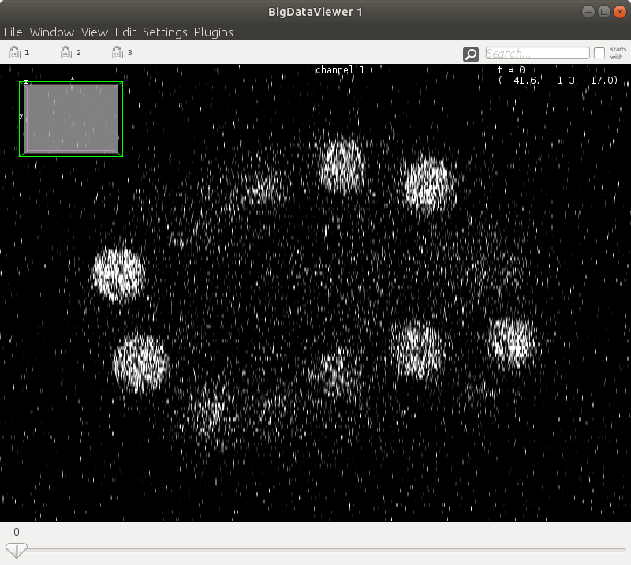
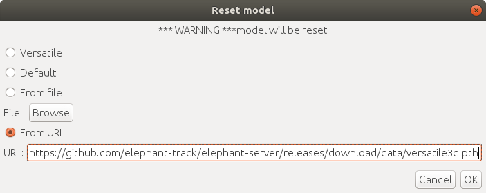
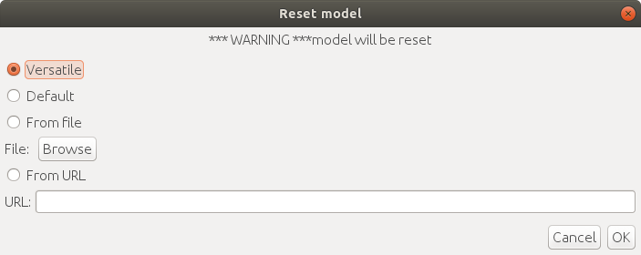

# ELEPHANT: Tracking cell lineages in 3D by incremental deep learning

<br>

<table class="topbox">
  <tbody>
    <tr>
      <th colspan=2></th>
    </tr>
    <tr>
      <td>Developer</td>
      <td><a href="https://github.com/ksugar">Ko Sugawara</a></td>
    </tr>
    <tr>
      <td>Forum</td>
      <td><a href="https://forum.image.sc/tag/elephant">Image.sc forum</a><br>Please post feedback and questions to the forum.<br>It is important to add the tag <code>elephant</code> to your posts so that we can reach you quickly.</td>
    </tr>
    <tr>
      <td>Source code</td>
      <td><a href="https://github.com/elephant-track">GitHub</a></td>
    </tr>
    <tr>
      <td>Publication</td>
      <td>Sugawara, K., Çevrim, C. & Averof, M. <a href="https://doi.org/10.7554/eLife.69380"><i>Tracking cell lineages in 3D by incremental deep learning.</i></a> eLife 2022. doi:10.7554/eLife.69380</td>
    </tr>
  </tbody>
</table>

</img>

## Overview

ELEPHANT is a platform for 3D cell tracking, based on incremental and interactive deep learning.\
It implements a client-server architecture. The server is built as a web application that serves deep learning-based algorithms.
The client application is implemented by extending [Mastodon](https://github.com/mastodon-sc/mastodon), providing a user interface for annotation, proofreading and visualization.
Please find <a href="#/?id=system-requirements" onclick="alwaysScroll(event)">below</a> the system requirements for each module.

<div class="toggle hidden">
  </img>
  <br>
  <a href="javascript:void(0)" onClick="setImageVisible(event, 'elephant-architecture')">image</a>
</div>

## Getting Started

The latest version of ELEPHANT is distributed using [Fiji](https://imagej.net/software/fiji/).

### Prerequisite

Please install [Fiji](https://imagej.net/software/fiji/) on your system and update the components using [ImageJ updater](https://imagej.net/plugins/updater).

### Installation

<iframe width="560" height="640" src="https://www.youtube-nocookie.com/embed/l5Qa53m5A7Q" title="YouTube video player" frameborder="0" allow="accelerometer; autoplay; clipboard-write; encrypted-media; gyroscope; picture-in-picture" allowfullscreen></iframe>

1. Start [Fiji](https://imagej.net/software/fiji/).
2. Run `Help > Update...` from the menu bar.
3. Click on the button `Manage update sites`.
4. Tick the checkboxes for `ELEPHANT` and `Mastodon` update sites.

  </img>
  </img>

5. Click on the button `Close` in the dialog `Manage update sites`.
6. Click on the button `Apply changes` in the dialog `ImageJ Updater`.
7. Restart [Fiji](https://imagej.net/software/fiji/).

| Info <br> :information_source: | When there is an update, ImageJ Updater will notify you. Alternatively, you can check the updates manually by running `Help > Update...`. It is recommended to keep up-to-date with the latest version of ELEPHANT to follow the new features and bug fixes. |
| :----------------------------: | :----------------------------------------------------------------------------------------------------------------------------------------------------------------------------------------------------------------------------------------------------------- |

### Prepare a Mastodon project

To start working with ELEPHANT, you need to prepare a Mastodon project.

#### 1. Prepare image data in the BDV format

[Download the demo data](https://doi.org/10.5281/zenodo.5519708) and extract the files as below.

```bash
elephant-demo
├── elephant-demo.h5
└── elephant-demo.xml
```

Alternatively, you can follow [the instructions here](https://imagej.net/plugins/bdv/#exporting-from-imagej-stacks) to prepare these files for your own data.

| Info <br> :information_source: | ELEPHANT provides a command line interface to convert image data stored in [Cell Tracking Challenge](http://celltrackingchallenge.net/) style to the BDV format. |
| :----------------------------: | :--------------------------------------------------------------------------------------------------------------------------------------------------------------- |

```bash
# Convert image data stored in Cell Tracking Challenge style to the BDV format
Fiji.app/ImageJ-linux64 --ij2 --headless --console --run Fiji.app/scripts/ctc2bdv.groovy "input='CTC_TIF_DIR', output='YOUR_DATA.xml', sizeX=0.32, sizeY=0.32, sizeZ=2.0, unit='µm'"
```

#### 2. Create a project

Click the `new Mastodon project` button in the `Mastodon launcher` window and click the `browse` button on the right.

Specify the `.xml` file for the dataset and click the `create` button on the bottom right.

</img>

Now, you will see the main window as shown below.

</img>

#### 3. Save & load a Mastodon project

To save the project, you can either run `File > Save Project`, click the `save`/`save as...` button in the main window, or use the shortcut `S`, generate a `.mastodon` file.

A `.mastodon` project file can be loaded by running `File > Load Project` or clicking the `open Mastodon project` button in the `Mastodon launcher` window.

### Setting up the ELEPHANT Server

The `Control Panel` is displayed by default at startup. If you cannot find it, run `Plugins > ELEPHANT > Window > Control Panel` to show it.

The `Control Panel` shows the statuses of the servers (ELEPHANT server and [RabbitMQ server](https://www.rabbitmq.com/)).\
It also provides functions for setting up the servers.

| Info <br> :information_source: | The ELEPHANT server provides main functionalities (e.g. detection, linking), while the RabbitMQ server is used to send messages to the client (e.g. progress, completion). |
| :----------------------------: | :------------------------------------------------------------------------------------------------------------------------------------------------------------------------- |

</img>

| Info <br> :information_source: | **DEPRECATED**: Google Colab has updated <a href="https://research.google.com/colaboratory/faq.html#limitations-and-restrictions">its policy</a> and restricted the use of SSH, with which ELEPHANT establish the connection. Please consider using Google Cloud instead. |
| :----------------------------: | :--------------------------------------------------------------------------------------------------------------------------------------------------------------- |

#### Setting up with Google Cloud

Here, we will set up the servers using [Google Cloud](https://cloud.google.com/), a cloud computing services by Google. You don't need to have a high-end GPU or a Linux machine to start using ELEPHANT's deep learning capabilities. Please follow the instructions in the video below to get started.

<iframe width="560" height="640" src="https://www.youtube.com/embed/JUPIYq6jAEA" title="YouTube video player" frameborder="0" allow="accelerometer; autoplay; clipboard-write; encrypted-media; gyroscope; picture-in-picture" allowfullscreen></iframe>

| Info <br> :information_source: | Advanced options for the server setup can be found <a href="#/?id=advanced-options-for-the-elephant-server" onclick="alwaysScroll(event)">here</a> |
| :----------------------------: | :------------------------------------------------------------------------------------------------------------------------------------------------- |

### Working with a BigDataViewer (BDV) window

#### 1. BigDataViewer window

Click the `bdv` button in the main window.

The following window will pop up.

</img>

#### 2. Shortcuts

ELEPHANT inherits the user-friendly [shortcuts](https://github.com/mastodon-sc/mastodon#actions-and-keyboard-shortcuts) from Mastodon. To follow this documentation, please find the `Keymap` tab from `File > Preferences...` and select the `Elephant` keymap from the pull down list.

</img>

The following table summaraizes the frequently-used actions used in the BDV window.

| Info <br> :information_source: | If you are already familiar with Mastodon, please note that some shortcuts are modified from [the default shortcuts](https://github.com/mastodon-sc/mastodon#actions-and-keyboard-shortcuts). |
| :----------------------------: | :-------------------------------------------------------------------------------------------------------------------------------------------------------------------------------------------- |

| Action                                                      | Shortcut                                                                                                                                                                           |
| ----------------------------------------------------------- | ---------------------------------------------------------------------------------------------------------------------------------------------------------------------------------- |
| Move in X & Y                                               | `Right-click`+`mouse-drag`                                                                                                                                                         |
| Move in Z                                                   | `Mouse-wheel` (Press and hold `Shift` to move faster, `Ctrl` to move slower)                                                                                                       |
| Align view with <br> XY / YZ / XZ planes                    | `Shift`+`Z` (XY plane) <br> `Shift`+`X` (YZ plane) <br> `Shift`+`Y` (XZ plane)                                                                                                     |
| Zoom / Unzoom                                               | `Ctrl`+`Shift`+`mouse-wheel`                                                                                                                                                       |
| Next time-point                                             | `3`                                                                                                                                                                                |
| Previous time-point                                         | `2`                                                                                                                                                                                |
| Brightness and color dialog                                 | `P`                                                                                                                                                                                |
| Save display settings                                       | `F11`                                                                                                                                                                              |
| Open a new BDV window                                       | `V`                                                                                                                                                                                |
| Add a new spot                                              | `A`                                                                                                                                                                                |
| Move the highlighted spot                                   | `Space`+`mouse-drag`                                                                                                                                                               |
| Remove the highlighted spot                                 | `D`                                                                                                                                                                                |
| Navigate to the highlighted spot                            | `W`                                                                                                                                                                                |
| Increase / Decrease the radius <br> of the highlighted spot | `E`/`Q` (Medium step)  <br> `Shift`+`E`/`Shift`+`Q` (Coarse step) <br> `Ctrl`+`E`/`Ctrl`+`Q` (Fine step) <br> `Alt`+`E`/`Alt`+`Q` (Selected axis with medium step) *ELEPHANT only* |
| Select axis                                                 | `Alt`+`X` (X axis) <br> `Alt`+`Y` (Y axis) &nbsp;&nbsp;&nbsp; *ELEPHANT only* <br> `Alt`+`Z` (Z axis)                                                                              |
| Rotate the highlighted spot                                 | `Alt`+`←` (Counterclockwise) / `Alt`+`→` (Clockwise)&nbsp;&nbsp;&nbsp; *ELEPHANT only*                                                                                             |

In the following steps, we use multiple BDV windows to visualize a 3D volume from different axes. Please open three BDV windows by clicking the `bdv` button in the main window (Shortcut: `V`), then rotate them to show one of XY, XZ or YZ plane using the shortcuts (`Shift`+`Z`, `Shift`+`Y` or `Shift`+`X`) on each window. Finally, synchronize them by clicking the key icon </img> on top left in each BDV window.

#### 3. Annotating spots

Ellipsoids can be added and manipulated to annotate spots (e.g. nuclei) using shortcuts.
Typically, the user will perform the following commands.

1. Add a spot (`A`)
2. Increase (`E`) / Decrease (`Q`) the radius of the spot
3. Select an axis to adjust the radius (`Alt`+`X` / `Alt`+`Y` / `Alt`+`Z`)
4. Increase (`Alt`+`E`) / Decrease (`Alt`+`Q`) the radius of the spot along the selected axis (a sphere becomes an ellipsoid)
5. Select an axis to rotate (`Alt`+`X` / `Alt`+`Y` / `Alt`+`Z`)
6. Rotate the spot along the selected axis counterclockwise (`Alt`+`←`) or clockwise (`Alt`+`→`)

Please put all BDV windows in the same group by clicking the key icon </img> on top left in the window to synchronize them.

<video controls>
  <source src="_media/ellipsoid-control.mp4" type="video/mp4">
  Your browser does not support the video tag.
</video> 

#### 4. Tagging spots

Spots are colored using the **Detection** coloring mode by default.\
You can change the coloring mode from `View > Coloring`.

| Status      | Color   |
| ----------- | ------- |
| Accepted    | Cyan    |
| Rejected    | Magenta |
| Unevaluated | Green   |

In the training module, the `Accepted` annotations are converted to foreground labels, and `Rejected` annotations are to background labels. Background labels can also be generated by an intensity thresholding, where the threshold is specified by the `auto BG threshold` parameter in the Preferences dialog.
ELEPHANT provides the following shortcut keys for annotating spots.

| Action  | Shortcut |
| ------- | -------- |
| Accepte | 4        |
| Reject  | 5        |

| Info <br> :information_source: | For advanced users: Please check <a href="#/?id=tag-sets-available-on-elephant" onclick="alwaysScroll(event)">here</a> |
| :----------------------------: | :--------------------------------------------------------------------------------------------------------------------- |

<video controls>
  <source src="_media/annotation-with-shortcuts-simple.mp4" type="video/mp4">
  Your browser does not support the video tag.
</video> 

#### 5. Adding links

Links can be added in the following four ways on the BDV window; pressing down one of the following keys (keydown) will move you automatically to the next or the previous timepoint (depending on the command, see below):

1. Keydown `A` on the highlighted spot, then keyup at the position where you want to add a linked spot in the next timepoint.
2. Keydown `L` on the highlighted spot, then keyup on the target annotated spot in the next timepoint.
3. Keydown `Shift`+`A` on the highlighted spot, then key up at the position you want to add a linked spot in the previous timepoint.
4. Keydown `Shift`+`L` on the highlighted spot, then keyup on the target annotated spot in the previous timepoint.

Spots and links that are added manually in this fashion are automatically tagged as `Approved` in the `Tracking` tag set.

To visualize the `Tracking` tag, set the coloring mode to `Tracking` by `View > Coloring > Tracking`.

<video controls>
  <source src="_media/linking-annotation.mp4" type="video/mp4">
  Your browser does not support the video tag.
</video> 

### Detection workflow

<iframe width="560" height="640" src="https://www.youtube-nocookie.com/embed/VScQb3vJylY" title="YouTube video player" frameborder="0" allow="accelerometer; autoplay; clipboard-write; encrypted-media; gyroscope; picture-in-picture" allowfullscreen></iframe>

| Info <br> :information_source: | In the following workflow, please put all relevant BDV windows in the `group 1` by clicking the key icon </img> on top left in the window. |
| :----------------------------: | :-------------------------------------------------------------------------------------------------------------------------------------------------------------------------- |

#### 1. Settings

Open a Preferences dialog `Plugins > ELEPHANT > Preferences...`.

</img>

Change the dataset name to `elephant-demo` (or the name you specified for your dataset).

When you change some value in the settings, a new setting profile is created automatically.

| Info <br> :information_source: | The profile name can be renamed. |
| :----------------------------: | :------------------------------- |

</img>

Press the `Apply` button on bottom right and close the settings dialog (`OK` or `x` button on top right).

Please check <a href="#/?id=settings-parameters" onclick="alwaysScroll(event)">the settings parameters table</a> for detailed descriptions about the parameters.

#### 2. Initialize a model

First, you need to initialize a model by `Plugins > ELEPHANT > Detection > Reset Detection Model`.

This command creates a new model parameter file with the name you specified in the settings (`detection.pth` by default) in the `workspace/models/` directory, which lies in the directory you launched on the server.
There are three options for initialization:
1. `Versatile`: initialize a model with a versatile pre-trained model
2. `Default`: initialize a model with intensity-based self-supervised training
3. `From File`: initialize a model from a local file
4. `From URL`: initialize a model from a specified URL

| Info <br> :information_source: | If a specified model is not initialized before prediction or training, ELEPHANT automatically initialize it with a versatile pre-trained model. |
| :----------------------------: | :---------------------------------------------------------------------------------------------------------------------------------------------- |

#### 3. Prediction

After initialization of a model you can try a prediction. `Plugins > ELEPHANT > Detection > Predict Spots`

| Info <br> :information_source: | `Alt`+`S` is a shortcut for prediction |
| :----------------------------: | :------------------------------------- |

</img>

#### 4. Training on batch mode

Based on the prediction results, you can add annotations as described earlier.

</img>

Train the model by `Plugins > ELEPHANT > Detection > Train Selected Timpepoints`.

Predictions with the updated model should yield better results.

</img>

In general, a batch mode is used for training with relatively large amounts of data. For more interactive training, please use the live mode explained below. 

#### 5. Training on live mode

In live mode, you can iterate the cycles of annotation, training, prediction and proofreading more frequently.

Start live mode by `Plugins > ELEPHANT > Detection > Live Training`.

During live mode, you can find the text "live mode" on top of the BDV view.

</img>

Every time you update the labels (Shortcut: `U`), a new training epoch will start, with the latest labels in the current timepoint.
To perform prediction with the latest model, the user needs to run `Predict Spots` (Shortcut: `Alt`+`S`) after the model is updated.

<video controls>
  <source src="_media/live-training.mp4" type="video/mp4">
  Your browser does not support the video tag.
</video> 

#### 6. Saving a model

The model parameter files are located under `workspace/models` on the server.\
If you are using your local machine as a server, these files should remain unless you do not delete them explicitly.\
If you are using Google Colab, you may need to save them before terminating the session.\
You can download the model parameter file by running `Plugins > ELEPHANT > Detection > Download Detection Model` or `Plugins > ELEPHANT > Linking > Download Flow Model`.\
Alternatively, you can make it persistent on your Google drive by uncommenting the first code cell in the Colab notebook.

</img>

You can find [pretrained parameter files](https://github.com/elephant-track/elephant-server/releases/tag/data) used in the paper.

#### 7. Importing a model

The model parameter file can be specified in the `Preferences` dialog, where the file path is relative to `/workspace/models/` on the server.\
There are three ways to import the pre-trained model parameters:
1. Run `Plugins > ELEPHANT > Detection > Reset Detection Model` and select the `From File` option with the local file.

  </img>
2. Upload the pre-trained parameters file to the website that provides a public download URL (e.g. GitHub, Google Drive, Dropbox). Run `Plugins > ELEPHANT > Detection > Reset Detection Model` and select the `From URL` option with the download URL.

  </img>
3. Directly place/replace the file at the specified file path on the server.


### Linking workflow

| Info <br> :information_source: | In the following workflow, please put all relevant BDV windows in the `group 1` by clicking the key icon </img> on top left in the window. |
| :----------------------------: | :-------------------------------------------------------------------------------------------------------------------------------------------------------------------------- |
#### 1. Prepare a dataset for linking

Here, we will load a project from [a .masotodon project](https://zenodo.org/record/5519708/files/elephant-demo.mastodon?download=1) that contains spots data. Please place the file in the same folder as the BDV files (`.h5` and `.xml`) are in.

```bash
elephant-demo
├── elephant-demo.h5
├── elephant-demo.xml
└── elephant-demo-with-spots.mastodon
```

Alternatively, you can complete detection by yourself.

#### 2. Settings for linking

We start with a linking using the nearest neighbor algorithm without flow support.

Please confirm that the `use optical flow for linking` option is `off`.

For other settings, please check <a href="#/?id=settings-parameters" onclick="alwaysScroll(event)">the detailed descriptions</a>.

#### 3. Nearest neighbor algorithm without flow support

In the demo dataset, please go to the last timepoint (t = 9).

Run the nearest neighbor linking action by `Alt`+`L` or `Plugins > ELEPHANT > Linking > Nearest Neighbor Linking`.

To open the TrackScheme window, click the button "trackscheme" in the Mastodon main window.

In the following steps, please set the coloring mode to `Tracking` by `View > Coloring > Tracking` in the TrackScheme window and the BigDataViewer window.

<video controls width>
  <source src="_media/nn-linking.mp4" type="video/mp4">
  Your browser does not support the video tag.
</video> 

#### 4. Nearest neighbor algorithm with flow support

Please turn on the `use optical flow for linking` option.

Please initialize the flow model with the `Versatile` option `Plugins > ELEPHANT > Linking > Reset Flow Model`.

</img>

Run the nearest neighbor linking action by `Alt`+`L` or `Plugins > ELEPHANT > Linking > Nearest Neighbor Linking`.

<video controls>
  <source src="_media/nn-flow-linking.mp4" type="video/mp4">
  Your browser does not support the video tag.
</video>

#### 5. Proofreading

Using both the BDV window and the trackscheme, you can remove/add/modify spots and links to build a complete lineage tree.

Once you finish proofreading of a track (or a tracklet), you can tag it as `Approved` in the `Tracking` tag set.

Select all spots and links in the track by `Shift`+`Space`, and `Edit > Tags > Tracking > Approved`. There is a set of shortcuts to perform tagging efficiently. The shortcut `Y` pops up a small window on top left in the TrackScheme window, where you can select the tag set, followed by the tag by pressing a number in the list. For example, `Edit > Tags > Tracking > Approved` corresponds to the set of shortcuts [`Y` > `2` > `1`].

Spots and links tagged with `Approved` will remain unless users do not reomove them explicitly (the `unlabeled` links will be removed at the start of the next prediction). The `Approved` links will also be used for training of a flow model.

| Info <br> :information_source: | If you cannot see the colors as in the video, please make sure that you set the coloring mode to `Tracking` by `View > Coloring > Tracking` in the TrackScheme window and the BigDataViewer window. |
| :----------------------------: | :-------------------------------------------------------------------------------------------------------------------------------------------------------------------------------------------------- |

<video controls>
  <source src="_media/linking-proofreading.mp4" type="video/mp4">
  Your browser does not support the video tag.
</video>

#### 6. Training a flow model

Once you collect certain amount of link annotations, a flow model can be trained with them by `Plugins > ELEPHANT > Linking > Train Optical Flow`.

Currently, there is only a batch mode for training of a flow model, which works with the annotations in the time range specified in the settings.

If you start training from scratch, it will take relatively long time to get the flow model to converge. Alternatively, you can incrementally train a model, starting with the pretrained model parameters.

## Action list

<table>
  <thead>
    <tr>
      <th>Category</th>
      <th>Action</th>
      <th>On Menu</th>
      <th>Shortcut</th>
      <th colspan=2>Description</th>
    </tr>
  </thead>
  <tbody>
    <!--Detection-->
    <tr>
      <td rowspan=9>Detection</td>
      <td>Predict Spots</td>
      <td>Yes</td>
      <td><code>Alt</code>+<code>S</code></td>
      <td>Predict spots with the specified model and parameters</td>
    </tr>
    <tr>
      <td>Predict Spots Around Mouse</td>
      <td>No</td>
      <td><code>Alt</code>+<code>Shift<code>+<code>S</code></td>
      <td>Predict spots around the mouse position on the BDV view</td>
    </tr>
    <tr>
      <td>Update Detection Labels</td>
      <td>Yes</td>
      <td><code>U</code></td>
      <td>Predict spots</td>
    </tr>
    <tr>
      <td>Reset Detection Labels</td>
      <td>Yes</td>
      <td>Not available</td>
      <td>Reset detection labels</td>
    </tr>
    <tr>
      <td>Start Live Training</td>
      <td>Yes</td>
      <td>Not available</td>
      <td>Start live training</td>
    </tr>
    <tr>
      <td>Train Detection Model (Selected Timepoints)</td>
      <td>Yes</td>
      <td>Not available</td>
      <td>Train a detection model with the annotated data from the specified timepoints</td>
    </tr>
    <tr>
      <td>Train Detection Model (All Timepoints)</td>
      <td>Yes</td>
      <td>Not available</td>
      <td>Train a detection model with the annotated data from all timepoints</td>
    </tr>
    <tr>
      <td>Reset Detection Model</td>
      <td>Yes</td>
      <td>Not available</td>
      <td>Reset a detection model by one of the following modes: `Versatile`, `Default`, `From File` or `From URL`</td>
    </tr>
    <tr>
      <td>Download Detection Model</td>
      <td>Yes</td>
      <td>Not available</td>
      <td>Download a detection model parameter file.</td>
    </tr>
    <!--Linking-->
    <tr>
      <td rowspan=6>Linking</td>
      <td>Nearest Neighbor Linking</td>
      <td>Yes</td>
      <td><code>Alt</code>+<code>L</code></td>
      <td>Perform nearest neighbor linking with the specified model and parameters</td>
    </tr>
    <tr>
      <td>Nearest Neighbor Linking Around Mouse</td>
      <td>No</td>
      <td><code>Alt</code>+<code>Shift</code>+<code>L</code></td>
      <td>Perform nearest neighbor linking around the mouse position on the BDV view</td>
    </tr>
    <tr>
      <td>Update Flow Labels</td>
      <td>Yes</td>
      <td>Not available</td>
      <td>Update flow labels</td>
    </tr>
    <tr>
      <td>Reset Flow Labels</td>
      <td>Yes</td>
      <td>Not available</td>
      <td>Reset flow labels</td>
    </tr>
    <tr>
      <td>Train Flow Model (Selected Timepoints)</td>
      <td>Yes</td>
      <td>Not available</td>
      <td>Train a flow model with the annotated data from the specified timepoints</td>
    </tr>
    <tr>
      <td>Reset Flow Model</td>
      <td>Yes</td>
      <td>Not available</td>
      <td>Reset a flow model by one of the following modes: `Versatile`, `Default`, `From File` or `From URL`</td>
    </tr>
    <tr>
      <td>Download Flow Model</td>
      <td>Yes</td>
      <td>Not available</td>
      <td>Download a flow model parameter file.</td>
    </tr>
    <!--Utils-->
    <tr>
      <td rowspan=13>Utils</td>
      <td>Map Spot Tag</td>
      <td>Yes</td>
      <td>Not available</td>
      <td>Map a spot tag to another spot tag</td>
    </tr>
    <tr>
      <td>Map Link Tag</td>
      <td>Yes</td>
      <td>Not available</td>
      <td>Map a link tag to another link tag</td>
    </tr>
    <tr>
      <td>Remove All Spots and Links</td>
      <td>Yes</td>
      <td>Not available</td>
      <td>Remove all spots and links</td>
    </tr>
    <tr>
      <td>Remove Short Tracks</td>
      <td>Yes</td>
      <td>Not available</td>
      <td>Remove spots and links in the tracks that are shorter than the specified length</td>
    </tr>
    <tr>
      <td>Remove Spots by Tag</td>
      <td>Yes</td>
      <td>Not available</td>
      <td>Remove spots with the specified tag</td>
    </tr>
    <tr>
      <td>Remove Links by Tag</td>
      <td>Yes</td>
      <td>Not available</td>
      <td>Remove spots with the specified tag</td>
    </tr>
    <tr>
      <td>Remove Visible Spots</td>
      <td>Yes</td>
      <td>Not available</td>
      <td>Remove spots in the current visible area for the specified timepoints</td>
    </tr>
    <tr>
      <td>Remove Self Links</td>
      <td>Yes</td>
      <td>Not available</td>
      <td>Remove accidentally generated links that connect the identical spots</td>
    </tr>
    <tr>
      <td>Take a Snapshot</td>
      <td>Yes</td>
      <td><code>H</code></td>
      <td>Take a snapshot in the specified BDV window</td>
    </tr>
    <tr>
      <td>Take a Snapshot Movie</td>
      <td>Yes</td>
      <td>Not available</td>
      <td>Take a snapshot movie in the specified BDV window</td>
    </tr>
    <tr>
      <td>Import Mastodon</td>
      <td>Yes</td>
      <td>Not available</td>
      <td>Import spots and links from a <code>.mastodon</code> file.</td>
    </tr>
    <tr>
      <td>Export CTC</td>
      <td>Yes</td>
      <td>Not available</td>
      <td>Export tracking results in a Cell Tracking Challenge format.<br>The tracks whose root spots are tagged with <code>Completed</code> are exported.</td>
    </tr>
    <tr>
      <td>Change Detection Tag Set Colors</td>
      <td>Yes</td>
      <td>Not available</td>
      <td>Change Detection tag set colors (<code>Basic</code> or <code>Advanced</code>)</td>
    </tr>
    <!--Analysis-->
    <tr>
      <td rowspan=5>Analysis</td>
      <td>Tag Progenitors</td>
      <td>Yes</td>
      <td>Not available</td>
      <td>Assign the <code>Progenitor</code> tags to the tracks whose root spots are tagged with <code>Completed</code>. Tags are automatically assigned starting from <code>1</code>. Currently, this action supports maximum <code>255</code> tags. </td>
    </tr>
    <tr>
      <td>Tag Progenitors</td>
      <td>Yes</td>
      <td>Not available</td>
      <td>Label the tracks with the following rule.
        <ol>
          <li><code>Proliferator</code>: the track contains at least one division</li>
          <li><code>Non-proliferator</code>: the track is completely tracked from <code>TIMEPOINT_THRESHOLD_LOWER</code> to <code>TIMEPOINT_THRESHOLD_HIGHER</code> and has no division</li>
          <li><code>Invisible</code>(undetermined): neither of the above applies</li>
        </ol>
      </td>
    </tr>
    <tr>
      <td>Tag Dividing Cells</td>
      <td>Yes</td>
      <td>Not available</td>
      <td>Tag the dividing and divided spots in the tracks as below.
        <ol>
            <li><code>Dividing</code>: the spots that divide between the current and next timepoint (two outgoing links)</li>
            <li><code>Divided</code>: the spots that divided between the previous and current timepoint</li>
            <li><code>Non-dividing</code>: neither of the above applies</li>
          </ol>
      </td>
    </tr>
    <tr>
      <td>Count Divisions (Entire)</td>
      <td rowspan=2>Yes</td>
      <td rowspan=2>Not available</td>
      <td rowspan=2>Count number of divisions in a lineage tree and output as a .csv file.<br>In the <code>Entire</code> mode, a total number of divisions per timepoint is calculated.<br>In the <code>Trackwise</code> mode, a trackwise number of divisions per timepoint is calculated.</td>
    </tr>
    <tr>
      <td>Count Divisions (Trackwise)</td>
    </tr>
    <!--Window-->
    <tr>
      <td rowspan=3>Window</td>
      <td>Client Log</td>
      <td>Yes</td>
      <td>Not available</td>
      <td>Show a client log window</td>
    </tr>
    <tr>
      <td>Server Log</td>
      <td>Yes</td>
      <td>Not available</td>
      <td>Show a server log window</td>
    </tr>
    <tr>
      <td>Control Panel</td>
      <td>Yes</td>
      <td>Not available</td>
      <td>Show a control panel window</td>
    </tr>
    <!--Abort Processing-->
    <tr>
      <td rowspan=2></td>
      <td>Abort Processing</td>
      <td>Yes</td>
      <td><code>Ctrl</code>+<code>C</code></td>
      <td>Abort the current processing</td>
    </tr>
    <!--Preferences-->
    <tr>
      <td>Preferences...</td>
      <td>Yes</td>
      <td>Not available</td>
      <td>Open a preferences dialog</td>
    </tr>
  </tbody>
</table>

## Tag details

The tagging function of Mastodon can provide specific information on each spot. ELEPHANT uses the **Tag** information for processing.

In the detection workflow, the **Detection** tag set is used (See <a href="#/?id=tag-sets-available-on-elephant" onclick="alwaysScroll(event)">below</a> for all provided tag sets available on ELEPHANT).

There are two color modes in the **Detection** tag set, `Basic` and `Advanced`.
You can switch between them from `Plugins > ELEPHANT > Utils > Change Detection Tag Set Colors`.

</img>

Predicted spots and manually added spots are tagged by default as `unlabeled` and `fn`, respectively.

These tags are used for training, where **true** spots and **false** spots can have different weights for training.

Highlighted spots can be tagged with one of the `Detection` tags using the shortcuts shown below.

| Tag       | Shortcut |
| --------- | -------- |
| tp        | 4        |
| fp        | 5        |
| tn        | 6        |
| fn        | 7        |
| tb        | 8        |
| fb        | 9        |
| unlabeled | 0        |

<video controls>
  <source src="_media/annotation-with-shortcuts.mp4" type="video/mp4">
  Your browser does not support the video tag.
</video> 


## Tag sets available on ELEPHANT

By default, ELEPHANT generates and uses the following tag sets.

<table>
  <thead>
    <tr>
      <th>Tag set</th>
      <th>Tag</th>
      <th>Color</th>
      <th colspan=2>Description</th>
    </tr>
  </thead>
  <tbody>
    <!--Detection-->
    <tr>
      <td rowspan=7>Detection</td>
      <td>tp</td>
      <td><span style="color: cyan;">■</span> cyan</td>
      <td rowspan=7>Annotate spots for<br>training and prediction<br>in a detection workflow</td>
      <td>true positive; generates <i>nucleus center</i> and <i>nucleus periphery</i> labels</td>
    </tr>
    <tr>
      <td>fp</td>
      <td><span style="color: magenta;">■</span> magenta</td>
      <td>false positive; generates <i>background</i> labels with a false weight</td>
    </tr>
    <tr>
      <td>tn</td>
      <td><span style="color: red;">■</span> red</td>
      <td>true negative; generates <i>background</i> labels</td>
    </tr>
    <tr>
      <td>fn</td>
      <td><span style="color: yellow;">■</span> yellow</td>
      <td>false negative; generates <i>nucleus center</i> and <i>nucleus periphery</i> labels with a false weight</td>
    </tr>
    <tr>
      <td>tb</td>
      <td><span style="color: #ffc800;">■</span> orange</td>
      <td>true border; generates <i>nucleus periphery</i> labels</td>
    </tr>
    <tr>
      <td>fb</td>
      <td><span style="color: #ffafaf;">■</span> pink</td>
      <td>false border; generates <i>nucleus periphery</i> labels with a false weight</td>
    </tr>
    <tr>
      <td>unlabeled</td>
      <td><span style="color: green;">■</span> green</td>
      <td>unevaluated; not used for labels</td>
    </tr>
    <!--Tracking-->
    <tr>
      <td rowspan=2>Tracking</td>
      <td>Approved</td>
      <td><span style="color: cyan;">■</span> cyan</td>
      <td rowspan=2>Annotate links for<br>training and prediction<br>in a linking workflow</td>
      <td>approved; generates flow labels</td>
    </tr>
    <tr>
      <td>unlabeled</td>
      <td><span style="color: green;">■</span> green</td>
      <td>unevaluated; not used for flow labels</td>
    </tr>
    <!--Progenitor-->
    <tr>
      <td rowspan=2>Progenitor</td>
      <td>1-255</td>
      <td>■ <a href="https://github.com/taketwo/glasbey">glasbey</a></td>
      <td rowspan=2>Visualize progenitors</td>
      <td>assigned by an anlysis plugin or manually by a user</td>
    </tr>
    <tr>
      <td>unlabeled</td>
      <td><span style="color: rgba(0,0,0,0);">■</span> invisible</td>
      <td>not assigned; invisible on the view</td>
    </tr>
    <!--Status-->
    <tr>
      <td>Status</td>
      <td>Completed</td>
      <td><span style="color: cyan;">■</span> cyan</td>
      <td>Label status of tracks</td>
      <td>completed tracks</td>
    </tr>
    <!--Division-->
    <tr>
      <td rowspan=4>Division</td>
      <td>Dividing</td>
      <td><span style="color: cyan;">■</span> cyan</td>
      <td rowspan=4>Annotate division<br>status of spots</td>
      <td>spots about to divide</td>
    </tr>
    <tr>
      <td>Divided</td>
      <td><span style="color: yellow;">■</span> yellow</td>
      <td>spots just divided</td>
    </tr>
    <tr>
      <td>Non-dividing</td>
      <td><span style="color: magenta;">■</span> magenta</td>
      <td>othe positive spots</td>
    </tr>
    <tr>
      <td>Invisible</td>
      <td><span style="color: rgba(0,0,0,0);">■</span> invisible</td>
      <td>negative spots are invisible</td>
    </tr>
    <!--Proliferator-->
    <tr>
      <td rowspan=3>Proliferator</td>
      <td>Proliferator</td>
      <td><span style="color: cyan;">■</span> cyan</td>
      <td rowspan=3>Annotate proliferation<br>status of spots</td>
      <td>spots in the proliferating lineage tree</td>
    </tr>
    <tr>
      <td>Non-proliferator</td>
      <td><span style="color: magenta;">■</span> magenta</td>
      <td>spots in the non-proliferating lineage tree</td>
    </tr>
    <tr>
      <td>Invisible</td>
      <td><span style="color: rgba(0,0,0,0);">■</span> invisible</td>
      <td>undetermined spots are invisible</td>
    </tr>
  </tbody>
</table>

## Settings parameters

<table>
  <thead>
    <tr>
      <th>Category</th>
      <th>Parameter</th>
      <th>Description</th>
    </tr>
  </thead>
  <tbody>
    <!--Basic Settings-->
    <tr>
      <td rowspan=22>Basic Settings</td>
      <td>prediction with patches</td>
      <td>If checked, prediction is performed on the patches with the size specified below.</td>
    </tr>
    <tr>
      <td>&emsp;&emsp;patch size x</td>
      <td>Patch size for x axis. If the <code>prediction with patches</code> is unchecked, it is not used.</td>
    </tr>
    <tr>
      <td>&emsp;&emsp;patch size y</td>
      <td>Patch size for y axis. If the <code>prediction with patches</code> is unchecked, it is not used.</td>
    </tr>
    <tr>
      <td>&emsp;&emsp;patch size z</td>
      <td>Patch size for z axis. If the <code>prediction with patches</code> is unchecked, it is not used.</td>
    </tr>
    <tr>
      <td>number of crops</td>
      <td>Number of crops per timepoint per epoch used for training.</td>
    </tr>
    <tr>
      <td>number of epochs</td>
      <td>Number of epochs for batch training. Ignored in live mode.</td>
    </tr>
    <tr>
      <td>time range</td>
      <td>Time range (backward) for prediction and batch training. For example, if the current time point is `10` and the specified time range is `5`, time points `[6, 7, 8, 9, 10]` are used for prediction and batch training.</td>
    </tr>
    <tr>
      <td>auto BG threshold</td>
      <td>Voxels with  the normalized value below <code>auto BG threshold</code> are considered as *BG* in the label generation step.</td>
    </tr>
    <tr>
      <td>learning rate</td>
      <td>Learning rate for training.</td>
    </tr>
    <tr>
      <td>probablility threshold</td>
      <td>Voxels with a center probability greater than this threshold are treated as the center of the ellipsoid in detection.</td>
    </tr>
    <tr>
      <td>suppression distance</td>
      <td>If the predicted spot has an existing spot (either <code>TP</code>, <code>FN</code> or <code>unlabeled</code>) within this value, one of the spots is suppressed.<br>If the existing spot is <code>TP</code> or <code>FN</code>, the predicted spot is suppressed.<br>If the existing spot is <code>unlabeled</code>, the smaller of the two spots is suppressed.</td>
    </tr>
    <tr>
      <td>min radius</td>
      <td>If one of the radii of the predicted spot is smaller than this value, the spot will be discarded.</td>
    </tr>
    <tr>
      <td>max radius</td>
      <td>Radii of the predicted spot is clamped to this value.</td>
    </tr>
    <tr>
      <td>NN linking threshold</td>
      <td>In the linking workflow, the length of the link should be smaller than this value.<br>If the optical flow is used in linking, the length is calculated as the distance based on the flow-corrected position of the spot. This value is referred to as <code>d_serch</code> in the paper.</td>
    </tr>
    <tr>
      <td>NN max edges</td>
      <td>This value determines the number of links allowed to be created in the linking Workflow.</td>
    </tr>
    <tr>
      <td>use optical flow for linking</td>
      <td>If checked, optical flow estimation is used to support nearest neighbor (NN) linking.</td>
    </tr>
    <tr>
      <td>use interpolation for linking</td>
      <td>If checked, the missing spots in the link are interpolated, which happens when 1 < <code>NN search neighbors</code>.</td>
    </tr>
    <tr>
      <td>dataset dir</td>
      <td>The path of the dataset dir stored on the server.<br>The path is relative to <code>/workspace/models/</code> on the server.</td>
    </tr>
    <tr>
      <td>detection model file</td>
      <td>The path of the [state_dict](https://pytorch.org/tutorials/beginner/saving_loading_models.html#what-is-a-state-dict) file for the detection model stored on the server.<br>The path is relative to <code>/workspace/models/</code> on the server.</td>
    </tr>
    <tr>
      <td>flow model file</td>
      <td>The path of the [state_dict](https://pytorch.org/tutorials/beginner/saving_loading_models.html#what-is-a-state-dict) file for the flow model stored on the server.<br>The path is relative to <code>/workspace/models/</code> on the server.</td>
    </tr>
    <tr>
      <td>detection Tensorboard log dir</td>
      <td>The path of the Tensorboard log dir for the detection model stored on the server.<br>The path is relative to <code>/workspace/logs/</code> on the server.</td>
    </tr>
    <tr>
      <td>flow Tensorboard log dir</td>
      <td>The path of the Tensorboard log dir for the flow model stored on the server.<br>The path is relative to <code>/workspace/logs/</code> on the server.</td>
    </tr>
    <!--Advanced Settings-->
    <tr>
      <td rowspan=28>Advanced Settings</td>
      <td>output prediction</td>
      <td>If checked, prediction output is save as <code>.zarr</code> on the server for the further inspection.</td>
    </tr>
    <tr>
      <td>apply slice-wise median correction</td>
      <td>If checked, the slice-wise median value is shifted to the volume-wise median value.<br>It cancels the uneven slice wise intensity distribution.</td>
    </tr>
    <tr>
      <td>mitigate edge discontinuities</td>
      <td>If checked, discontinuities found in the edge regions of the prediction are mitigated.<br>The required memory size will increase slightly.</td>
    </tr>
    <tr>
      <td>rescale x</td>
      <td>rescale the image data in x axis with this value.</td>
    </tr>
    <tr>
      <td>rescale y</td>
      <td>rescale the image data in y axis with this value.</td>
    </tr>
    <tr>
      <td>rescale z</td>
      <td>rescale the image data in z axis with this value.</td>
    </tr>
    <tr>
      <td>training crop size x</td>
      <td>Training crop size for x axis. The smaller of this parameter and the x dimension of the image is used for the actual crop size x.</td>
    </tr>
    <tr>
      <td>training crop size y</td>
      <td>Training crop size for y axis. The smaller of this parameter and the y dimension of the image is used for the actual crop size y.</td>
    </tr>
    <tr>
      <td>training crop size z</td>
      <td>Training crop size for z axis. The smaller of this parameter and the z dimension of the image is used for the actual crop size z.</td>
    </tr>
    <tr>
      <td>batch size</td>
      <td>Batch size for training and prediction.</td>
    </tr>
    <tr>
      <td>class weight background</td>
      <td>Class weight for <i>background</i> in the loss function for the detection model.</td>
    </tr>
    <tr>
      <td>class weight border</td>
      <td>Class weight for <i>border</i> in the loss function for the detection model.</td>
    </tr>
    <tr>
      <td>class weight center</td>
      <td>Class weight for <i>center</i> in the loss function for the detection model.</td>
    </tr>
    <tr>
      <td>flow dim weight x</td>
      <td>Weight for <i>x dimension</i> in the loss function for the flow model.</td>
    </tr>
    <tr>
      <td>flow dim weight y</td>
      <td>Weight for <i>y dimension</i> in the loss function for the flow model.</td>
    </tr>
    <tr>
      <td>flow dim weight z</td>
      <td>Weight for <i>z dimension</i> in the loss function for the flow model.</td>
    </tr>
    <tr>
      <td>false weight</td>
      <td>Labels generated from false annotations (<code>FN</code>, <code>FP</code>, <code>FB</code>) are weighted with this value in loss calculation during training (relative to true annotations).</td>
    </tr>
    <tr>
      <td>center ratio</td>
      <td>Center ratio of the ellipsoid used in label generation and detection.</td>
    </tr>
    <tr>
      <td>max displacement</td>
      <td>Maximum displacement that would be predicted with the flow model. This value is used to scale the output from the flow model.<br>Training and prediction should use the same value for this parameter. If you want to transfer the flow model to another dataset, this value should be kept.</td>
    </tr>
    <tr>
      <td>augmentation scale factor base</td>
      <td>In training, the image volume is scaled randomly based on this value.<br>e.g. If this value is 0.2, the scaling factors for three axes are randomly picke up from the range [0.8, 1.2].</td>
    </tr>
    <tr>
      <td>augmentation rotation angle</td>
      <td>In training, the XY plane is randomly rotated based on this value. The unit is degree.<br>e.g. If this value is 30, the rotation angle is randomly picked up from the range [-30, 30].</td>
    </tr>
    <tr>
      <td>augmentation contrast</td>
      <td>In training, the contrast is modified randomly based on this value.<br>e.g. If this value is 0.2, the contrast is randomly picked up from the range [0.8, 1].</td>
    </tr>
    <tr>
      <td>NN search depth</td>
      <td>This value determines how many timepoints the algorithm searches for the parent spot in the linking workflow.</td>
    </tr>
    <tr>
      <td>NN search neighbors</td>
      <td>This value determines how many neighbors are considered as candidates for the parent spot in the linking workflow.</td>
    </tr>
    <tr>
      <td>Training log intervals</td>
      <td>This value specifies how frequently the logging takes place in training.</td>
    </tr>
    <tr>
      <td>Cache maximum bytes (MiB)</td>
      <td>This value specifies the memory size to be used for caching. Caching enables faster data loading.</td>
    </tr>
    <tr>
      <td>use memmap</td>
      <td>This value specifies if a <a href=https://numpy.org/doc/stable/reference/generated/numpy.memmap.html>memory-map</a> is enabled in data loading. Memory-map enables memory-efficient data loading. Memory-mapped files are stored in <code>workspace/memmaps</code> which can grow large as these files accumulate. The user can delete these files when they are not needed.</td>
    </tr>
    <tr>
      <td>log file basename</td>
      <td>This value specifies log file basename.<br><code>~/.mastodon/logs/client_BASENAME.log</code>, <code>~/.mastodon/logs/server_BASENAME.log</code> will be created and used as log files.</td>
    </tr>
    <!--Server Settings-->
    <tr>
      <td rowspan=5>Server Settings</td>
      <td>ELEPHANT server URL with port number</td>
      <td>URL for the ELEPHANT server. It should include the port number (e.g. <code>http://localhost:8080</code>)</td>
    </tr>
    <tr>
      <td>RabbitMQ server port</td>
      <td>Port number of the RabbitMQ server.</td>
    </tr>
    <tr>
      <td>RabbitMQ server host name</td>
      <td>Host name of the RabbitMQ server. (e.g. <code>localhost</code>)</td>
    </tr>
    <tr>
      <td>RabbitMQ server username</td>
      <td>Username for the RabbitMQ server.</td>
    </tr>
    <tr>
      <td>RabbitMQ server password</td>
      <td>Password for the RabbitMQ server.</td>
    </tr>
  </tbody>
</table>

| Info <br> :information_source: | ELEPHANT provides options for faster and memory-efficient data loading. Caching mechanism directly store the loaded data in RAM using the Least Recently Used storategy. The user can specify the maximum size of RAM for caching in the preferences dialog. <a href=https://numpy.org/doc/stable/reference/generated/numpy.memmap.html>Memory-map</a> is another optional layer in data loading. Memory-map stores an array in a binary format and accesses data chunks only when they are required, enabling a meomory-efficient data handling. The above two options can be used together. |
| :----------------------------: | :-------------------------------------------------------------------------------------------------------------------------------------------------------------------------------------------------------------------------------------------------------------------------------------------------------------------------------------------------------------------------------------------------------------------------------------------------------------------------------------------------------------------------------------------------------------------------------------------- |

## System Requirements

### ELEPHANT Server Requirements (Docker)

|                  | Requirements                                                                                                                                                                                                                                                                                |
| ---------------- | ------------------------------------------------------------------------------------------------------------------------------------------------------------------------------------------------------------------------------------------------------------------------------------------- |
| Operating System | Linux-based OS compatible with [NVIDIA Container Toolkit](https://docs.nvidia.com/datacenter/cloud-native/container-toolkit/install-guide.html)                                                                                                                                             |
| Docker           | [Docker](https://www.docker.com/) with [NVIDIA Container Toolkit](https://docs.nvidia.com/datacenter/cloud-native/container-toolkit/install-guide.html) (see [supported versions](https://docs.nvidia.com/datacenter/cloud-native/container-toolkit/install-guide.html#container-runtimes)) |
| GPU              | NVIDIA CUDA GPU with sufficient VRAM for your data (recommended: 11 GB or higher)                                                                                                                                                                                                           |
| Storage          | Sufficient size for your data (recommended: 1 TB or higher)                                                                                                                                                                                                                                 |
### ELEPHANT Server Requirements (Singularity)

|                  | Requirements                                                                                                                                                    |
| ---------------- | --------------------------------------------------------------------------------------------------------------------------------------------------------------- |
| Operating System | Linux-based OS                                                                                                                                                  |
| Singularity      | [Singularity](https://sylabs.io/guides/3.7/user-guide/index.html) (see [requirements for NVIDIA GPUs & CUDA](https://sylabs.io/guides/3.7/user-guide/gpu.html)) |
| GPU              | NVIDIA CUDA GPU with sufficient VRAM for your data (recommended: 11 GB or higher)                                                                               |
| Storage          | Sufficient size for your data (recommended: 1 TB or higher)                                                                                                     |

| Info <br> :information_source: | The total amount of data can be 10-30 times larger than the original data size when the prediction outputs (optional) are generated. |
| :----------------------------: | :----------------------------------------------------------------------------------------------------------------------------------- |

### ELEPHANT Client Requirements

|                  | Requirements                                                                                                                   |
| ---------------- | ------------------------------------------------------------------------------------------------------------------------------ |
| Operating System | Linux, Mac or Windows OS                                                                                                       |
| Java             | Java Runtime Environment 8 or higher                                                                                           |
| Storage          | Sufficient size for your data (Please consider using [BigDataServer](https://imagej.net/plugins/bdv/server) for the huge data) |

## ELEPHANT Data Overview

The ELEPHANT client uses the same type of image files as Mastodon. The image data are imported as a pair of HDF5 (`.h5`) and XML (`.xml`)
files from BigDataViewer (BDV).

The ELEPHANT server stores image, annotation and prediction data in Zarr (`.zarr`) format.

| Data type                  | Client                         | Server         |
| -------------------------- | ------------------------------ | -------------- |
| Image                      | HDF5 (`.h5`)                   | Zarr (`.zarr`) |
| Image metadata             | XML (`.xml`)                   | Not available  |
| Annotation                 | Mastodon project (`.mastodon`) | Zarr (`.zarr`) |
| Prediction                 | Mastodon project (`.mastodon`) | Zarr (`.zarr`) |
| Project metadata           | Mastodon project (`.mastodon`) | Not available  |
| Viewer settings (Optional) | XML (`.xml`)                   | Not available  |

## Advanced options for the ELEPHANT Server

There are three options to set up the ELEPHANT server.

- <a href="#/?id=setting-up-with-docker" onclick="alwaysScroll(event)">Setting up with Docker</a>
  
  This option is recommended if you have a powerful computer that satisfies <a href="#/?id=elephant-server-requirements-docker" onclick="alwaysScroll(event)">the server requirements (Docker)</a> with root privileges.

- <a href="#/?id=setting-up-with-singularity" onclick="alwaysScroll(event)">Setting up with Singularity</a>
  
  This option is recommended if you can access a powerful computer that satisfies <a href="#/?id=elephant-server-requirements-singularity" onclick="alwaysScroll(event)">the server requirements (Singularity)</a> as a non-root user (e.g. HPC cluster).

- <a href="#/?id=setting-up-with-google-cloud" onclick="alwaysScroll(event)">Setting up with Google Cloud</a>
  
  Alternatively, you can set up the ELEPHANT server with [Google Cloud](https://cloud.google.com/), a cloud computing services by Google. In this option, you don't need to have a high-end GPU or a Linux machine to start using ELEPHANT's deep learning capabilities.

| Info <br> :information_source: | **DEPRECATED**: Google Colab has updated <a href="https://research.google.com/colaboratory/faq.html#limitations-and-restrictions">its policy</a> and restricted the use of SSH, with which ELEPHANT establish the connection. Please consider using Google Cloud instead. |
| :----------------------------: | :--------------------------------------------------------------------------------------------------------------------------------------------------------------- |


#### Setting up with Docker

##### Prerequisite

Please check that your computer meets <a href="#/?id=elephant-server-requirements" onclick="alwaysScroll(event)">the server requirements</a>.

Install [Docker](https://www.docker.com/) with [NVIDIA Container Toolkit](https://github.com/NVIDIA/nvidia-docker).

By defaut, ELEPHANT assumes you can [run Docker as a non-root user](https://docs.docker.com/engine/install/linux-postinstall/).\
If you need to run `Docker` with `sudo`, please set the environment variable `ELEPHANT_DOCKER` as below.

```bash
export ELEPHANT_DOCKER="sudo docker"
```

Alternatively, you can set it at runtime.

```bash
make ELEPHANT_DOCKER="sudo docker" bash
```

##### 1.Download/Clone a repository

Download and extract the latest release of the ELEPHANT server [here](https://github.com/elephant-track/elephant-server/archive/refs/tags/v0.5.0.zip).

Alternatively, you can clone a repository from [GitHub](https://github.com/elephant-track/elephant-server).

```bash
git clone https://github.com/elephant-track/elephant-server.git
```

##### 2. Build a Docker image

First, change the directory to the project root.

```bash
cd elephant-server
```

The following command will build a Docker image that integrates all the required modules.

```bash
make build
```

##### 3. Generate a dataset for the ELEPHANT server (Optional)

| Info <br> :information_source: | In the latest version, this step can be done automatically and you do not need to do it manually if there is no particular reason. |
| :----------------------------: | :--------------------------------------------------------------------------------------------------------------------------------- |

Please [prepare](https://imagej.net/plugins/bdv/#exporting-from-imagej-stacks) your image data, producing a pair of [BigDataViewer](https://imagej.net/plugins/bdv/) `.h5` and `.xml` files, or [download the demo data](https://doi.org/10.5281/zenodo.5519708) and extract it as below.

The ELEPHANT server deals with images using [Zarr](https://zarr.readthedocs.io/en/stable/). The following command generates required `zarr` files from the [BigDataViewer](https://imagej.net/plugins/bdv/) `.h5` file.


```bash
workspace
├── datasets
│   └── elephant-demo
│       ├── elephant-demo.h5
│       └── elephant-demo.xml
```

Run the script inside a Docker container.

```bash
make bash # run bash inside a docker container
```

```bash
python /opt/elephant/script/dataset_generator.py --uint16 /workspace/datasets/elephant-demo/elephant-demo.h5 /workspace/datasets/elephant-demo
# usage: dataset_generator.py [-h] [--uint16] [--divisor DIVISOR] input output

# positional arguments:
#   input              input .h5 file
#   output             output directory

# optional arguments:
#   -h, --help         show this help message and exit
#   --uint16           with this flag, the original image will be stored with
#                      uint16
#                      default: False (uint8)
#   --divisor DIVISOR  divide the original pixel values by this value (with
#                      uint8, the values should be scale-downed to 0-255)

exit # exit from a docker container
```

You will find the following results.

```
workspace
├── datasets
│   └── elephant-demo
│       ├── elephant-demo.h5
│       ├── elephant-demo.xml
│       ├── flow_hashes.zarr
│       ├── flow_labels.zarr
│       ├── flow_outputs.zarr
│       ├── imgs.zarr
│       ├── seg_labels_vis.zarr
│       ├── seg_labels.zarr
│       └── seg_outputs.zarr
```

| Info <br> :information_source: | By default, the docker container is launched with [volumes](https://docs.docker.com/storage/volumes/), mapping the local `workspace/` directory to the `/workspace/` directory in the container. <br> The local workspace directory can be set by the `ELEPHANT_WORKSPACE` environment variable (Default: `${PWD}/workspace`). |
| :----------------------------: | :----------------------------------------------------------------------------------------------------------------------------------------------------------------------------------------------------------------------------------------------------------------------------------------------------------------------------- |

```bash
# This is optional
export ELEPHANT_WORKSPACE="YOUR_WORKSPACE_DIR"
make bash
```

```bash
# This is optional
make ELEPHANT_WORKSPACE="YOUR_WORKSPACE_DIR" bash
```

| Info <br> :information_source: | Multi-view data is not supported by ELEPHANT. You need to create a fused data (e.g. with [BigStitcher Fuse](https://imagej.net/plugins/bigstitcher/fuse)) before converting to `.zarr` . |
| :----------------------------: | :--------------------------------------------------------------------------------------------------------------------------------------------------------------------------------------- |

##### 4. Launch the ELEPHANT server via Docker

The ELEPHANT server is accompanied by several services, including [Flask](https://flask.palletsprojects.com/en/1.1.x/),
[uWSGI](https://uwsgi-docs.readthedocs.io/en/latest/), [NGINX](https://www.nginx.com/), [redis](https://redis.io/)
and [RabbitMQ](https://www.rabbitmq.com/).
These services are organized by [Supervisord](http://supervisord.org/) inside the Docker container,
exposing the port `8080` for [NGINX](https://www.nginx.com/) and `5672` for [RabbitMQ](https://www.rabbitmq.com/) available on `localhost`. 

```bash
make launch # launch the services
```

Now, the ELEPHANT server is ready.

#### Setting up with Singularity

##### Prerequisite

`Singularity >= 3.6.0` is required. Please check the version of Singularity on your system.

```bash
singularity --version
```

Download and extract the latest release of the ELEPHANT server [here](https://github.com/elephant-track/elephant-server/archive/refs/tags/v0.5.0.zip).

Alternatively, you can clone a repository from [GitHub](https://github.com/elephant-track/elephant-server).

##### 1. Build a container

Run the following command at the project root directory where you can find a `elephant.def` file.\
The following command build a singularity container (`delephant.sif`) and copies `/var/lib/`, `/var/log/` and `/var/run/` in the container to `$HOME/.elephant_binds` on the host.

```bash
make singularity-build
```

##### 2. Start an instance for the ELEPHANT server

The command below starts an `instance` ([see details](https://sylabs.io/guides/3.7/user-guide/running_services.html#container-instances-in-singularity)) named `elephant` using the image written in `elephant.sif`.\
Please set the environment variable `ELEPHANT_WORKSPACE` to the `workspace` directory on your system.

```bash
make singularity-launch
```

Please specify the environment variable `ELEPHANT_GPU` if you want to use a specific GPU device on your system (default: `all`).

```bash
ELEPHANT_GPU=0 make singularity-launch
```

At this point, you will be able to work with the ELEPHANT server.
Please follow <a href="#/?id=remote-connection-to-the-elephant-server" onclick="alwaysScroll(event)">the instructions for seting up the remote connection</a>.

##### 3. Stop an instance for the ELEPHANT server

After exiting the `exec` by `Ctrl+C`, please do not forget to stop the `instance`.

```bash
make singularity-stop
```

## Remote connection to the ELEPHANT server

The ELEPHANT server can be accessed remotely by exposing the ports for `NGINX` (`8080` by default) and `RabbitMQ` (`5672` by default) .

To establish connections to the server, one option would be to use SSH portforwarding.\
You can use the `Control Panel` to establish these connections. Please set the parameters and press the `Add Port Forward` button.

</img>

Alternatively, you can use CLI. Assuming that you can access to the computer that launches the ELEPHANT server by `ssh USERNAME@HOSTNAME` (or `ssh.exe USERNAME@HOSTNAME` on Windows), you can forward the ports for ELEPHANT as below.

```bash
ssh -N -L 8080:localhost:8080 USERNAME@HOSTNAME # NGINX
ssh -N -L 5672:localhost:5672 USERNAME@HOSTNAME # RabbitMQ
```

```powershell
ssh.exe -N -L 8080:localhost:8080 USERNAME@HOSTNAME # NGINX
ssh.exe -N -L 5672:localhost:5672 USERNAME@HOSTNAME # RabbitMQ
```

After establishing these connections, the ELEPHANT client can communicate with the ELEPHANT server just as launched on localhost.

## Demo Data
[](https://doi.org/10.5281/zenodo.5519708)

## Acknowledgements

This research was supported by the European Research Council, under the European Union Horizon 2020 programme, grant ERC-2015-AdG #694918. The software is developed in Institut de Génomique Fonctionnelle de Lyon (IGFL) / Centre national de la recherche scientifique (CNRS).

- ELEPHANT client
  - [Mastodon](https://github.com/mastodon-sc/mastodon)
  - [BigDataViewer](https://github.com/bigdataviewer/bigdataviewer-core)
  - [SciJava](https://scijava.org/)
  - [Unirest-java](http://kong.github.io/unirest-java/)
- ELEPHANT server
  - [PyTorch](https://pytorch.org/)
  - [Numpy](https://numpy.org/)
  - [Scipy](https://www.scipy.org/)
  - [scikit-image](https://scikit-image.org/)
  - [Flask](https://flask.palletsprojects.com/en/1.1.x/)
  - [uWSGI](https://uwsgi-docs.readthedocs.io/en/latest/)
  - [NGINX](https://www.nginx.com/)
  - [Redis](https://redis.io/)
  - [RabbitMQ](https://www.rabbitmq.com/)
  - [Supervisord](http://supervisord.org/)
  - [uwsgi-nginx-flask-docker](https://github.com/tiangolo/uwsgi-nginx-flask-docker)
  - [ngrok](https://ngrok.com/)
  - [Google Colab](https://colab.research.google.com)
- ELEPHANT docs
  - [Docsify](https://docsify.js.org)

and other great projects.

## Contact

[Ko Sugawara](https://github.com/ksugar)

Please post feedback and questions to the [Image.sc forum](https://forum.image.sc/tag/elephant).\
It is important to add the tag `elephant` to your posts so that we can reach you quickly.
## Citation

Please cite our paper on [eLife](https://doi.org/10.7554/eLife.69380).

- Sugawara, K., Çevrim, C. & Averof, M. [*Tracking cell lineages in 3D by incremental deep learning.*](https://doi.org/10.7554/eLife.69380) eLife 2022. doi:10.7554/eLife.69380

```.bib
@article {Sugawara2022,
	author = {Sugawara, Ko and {\c{C}}evrim, {\c{C}}a?r? and Averof, Michalis},
	title = {Tracking cell lineages in 3D by incremental deep learning},
	year = {2022},
	doi = {10.7554/eLife.69380},
	abstract = {Deep learning is emerging as a powerful approach for bioimage analysis. Its use in cell tracking is limited by the scarcity of annotated data for the training of deep-learning models. Moreover, annotation, training, prediction, and proofreading currently lack a unified user interface. We present ELEPHANT, an interactive platform for 3D cell tracking that addresses these challenges by taking an incremental approach to deep learning. ELEPHANT provides an interface that seamlessly integrates cell track annotation, deep learning, prediction, and proofreading. This enables users to implement cycles of incremental learning starting from a few annotated nuclei. Successive prediction-validation cycles enrich the training data, leading to rapid improvements in tracking performance. We test the software's performance against state-of-the-art methods and track lineages spanning the entire course of leg regeneration in a crustacean over 1 week (504 time-points). ELEPHANT yields accurate, fully-validated cell lineages with a modest investment in time and effort.},
	URL = {https://doi.org/10.7554/eLife.69380},
	journal = {eLife}
}
```

<div style="text-align: right"><a href="_media/elephant.bib">download as .bib file</a></div>


## License

[BSD-2-Clause](_LICENSE.md)
